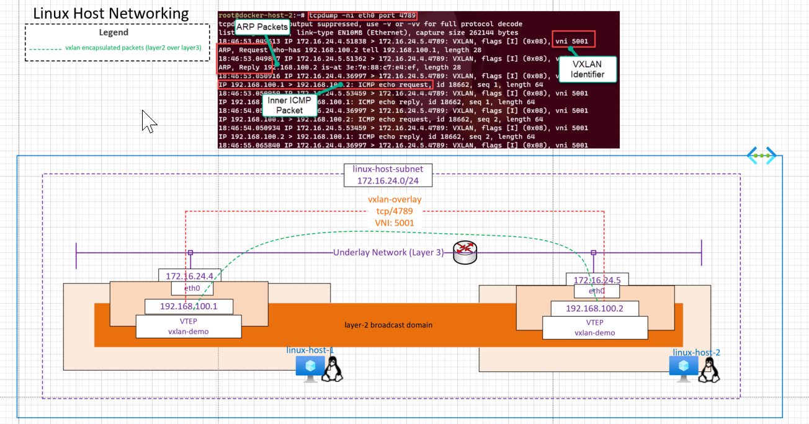

# VXLAN overlay with two linux hosts

This architecture demonstrates VXLAN network overlay between two linux host in it's simplest form. This is the fundamental prinicpal behind cluster networking.

# Reference Architecture



# Design Components

1. Two Ubuntu linux VMs deployed in a subnet with eth0 interface
2. VXLAN-demo interface acting as the VTEP and creating the overlay(layer2 over layer3)
3. Packet captures showing VXLAN encapsulated ICMP packets

# VXLAN between two linux hosts (As good as it gets!)

## Linux host 1

Before: Notice no vxlan interface

```
root@docker-host-1:~# ip add sh
1: lo: <LOOPBACK,UP,LOWER_UP> mtu 65536 qdisc noqueue state UNKNOWN group default qlen 1000
    link/loopback 00:00:00:00:00:00 brd 00:00:00:00:00:00
    inet 127.0.0.1/8 scope host lo
       valid_lft forever preferred_lft forever
    inet6 ::1/128 scope host
       valid_lft forever preferred_lft forever
2: eth0: <BROADCAST,MULTICAST,UP,LOWER_UP> mtu 1500 qdisc mq state UP group default qlen 1000
    link/ether 00:22:48:1e:1a:09 brd ff:ff:ff:ff:ff:ff
    inet 172.16.24.4/24 brd 172.16.24.255 scope global eth0
       valid_lft forever preferred_lft forever
    inet6 fe80::222:48ff:fe1e:1a09/64 scope link
       valid_lft forever preferred_lft forever
3: docker0: <NO-CARRIER,BROADCAST,MULTICAST,UP> mtu 1500 qdisc noqueue state DOWN group default
    link/ether 02:42:3a:2c:88:bf brd ff:ff:ff:ff:ff:ff
    inet 172.17.0.1/16 brd 172.17.255.255 scope global docker0
       valid_lft forever preferred_lft forever
    inet6 fe80::42:3aff:fe2c:88bf/64 scope link
       valid_lft forever preferred_lft forever

```

Configure VXLAN. Using VXLAN Port of 4789. Per RFC link [here](https://datatracker.ietf.org/doc/html/rfc7348)

```
    -  Destination Port: IANA has assigned the value 4789 for the
         VXLAN UDP port, and this value SHOULD be used by default as the
         destination UDP port.  Some early implementations of VXLAN have
         used other values for the destination port.  To enable
         interoperability with these implementations, the destination
         port SHOULD be configurable.

```

```
root@docker-host-1:~# ip link add vxlan-demo type vxlan id 5001 remote 172.16.24.5 local 172.16.24.4 de
v eth0 dstport 4789
root@docker-host-1:~# ip addr add 192.168.100.1/24 dev vxlan-demo

root@docker-host-1:~# ip add
1: lo: <LOOPBACK,UP,LOWER_UP> mtu 65536 qdisc noqueue state UNKNOWN group default qlen 1000
    link/loopback 00:00:00:00:00:00 brd 00:00:00:00:00:00
    inet 127.0.0.1/8 scope host lo
       valid_lft forever preferred_lft forever
    inet6 ::1/128 scope host
       valid_lft forever preferred_lft forever
2: eth0: <BROADCAST,MULTICAST,UP,LOWER_UP> mtu 1500 qdisc mq state UP group default qlen 1000
    link/ether 00:22:48:1e:1a:09 brd ff:ff:ff:ff:ff:ff
    inet 172.16.24.4/24 brd 172.16.24.255 scope global eth0
       valid_lft forever preferred_lft forever
    inet6 fe80::222:48ff:fe1e:1a09/64 scope link
       valid_lft forever preferred_lft forever
3: docker0: <NO-CARRIER,BROADCAST,MULTICAST,UP> mtu 1500 qdisc noqueue state DOWN group default
    link/ether 02:42:3a:2c:88:bf brd ff:ff:ff:ff:ff:ff
    inet 172.17.0.1/16 brd 172.17.255.255 scope global docker0
       valid_lft forever preferred_lft forever
    inet6 fe80::42:3aff:fe2c:88bf/64 scope link
       valid_lft forever preferred_lft forever
109: vxlan-demo: <BROADCAST,MULTICAST,UP,LOWER_UP> mtu 1450 qdisc noqueue state UNKNOWN group default qlen 1000
    link/ether 7a:1e:dd:83:9f:2f brd ff:ff:ff:ff:ff:ff
    inet 192.168.100.1/24 scope global vxlan-demo
       valid_lft forever preferred_lft forever
    inet6 fe80::781e:ddff:fe83:9f2f/64 scope link
       valid_lft forever preferred_lft forever

```

## Linux host 2

```
root@docker-host-2:~# ip link add vxlan-demo type vxlan id 5001 remote 172.16.24.4 local 172.16.24.5 de
v eth0 dstport 4789

root@docker-host-2:~# ip addr add 192.168.100.2/24 dev vxlan-demo
root@docker-host-2:~# ip link set up dev vxlan-demo

root@docker-host-2:~# ip add
1: lo: <LOOPBACK,UP,LOWER_UP> mtu 65536 qdisc noqueue state UNKNOWN group default qlen 1000
    link/loopback 00:00:00:00:00:00 brd 00:00:00:00:00:00
    inet 127.0.0.1/8 scope host lo
       valid_lft forever preferred_lft forever
    inet6 ::1/128 scope host
       valid_lft forever preferred_lft forever
2: eth0: <BROADCAST,MULTICAST,UP,LOWER_UP> mtu 1500 qdisc mq state UP group default qlen 1000
    link/ether 00:0d:3a:8b:a6:59 brd ff:ff:ff:ff:ff:ff
    inet 172.16.24.5/24 brd 172.16.24.255 scope global eth0
       valid_lft forever preferred_lft forever
    inet6 fe80::20d:3aff:fe8b:a659/64 scope link
       valid_lft forever preferred_lft forever
3: docker0: <NO-CARRIER,BROADCAST,MULTICAST,UP> mtu 1500 qdisc noqueue state DOWN group default
    link/ether 02:42:6b:45:fc:ba brd ff:ff:ff:ff:ff:ff
    inet 172.17.0.1/16 brd 172.17.255.255 scope global docker0
       valid_lft forever preferred_lft forever
    inet6 fe80::42:6bff:fe45:fcba/64 scope link
       valid_lft forever preferred_lft forever
73: vxlan-demo: <BROADCAST,MULTICAST,UP,LOWER_UP> mtu 1450 qdisc noqueue state UNKNOWN group default qlen 1000
    link/ether 3e:7e:88:c7:e4:ef brd ff:ff:ff:ff:ff:ff
    inet 192.168.100.2/24 scope global vxlan-demo
       valid_lft forever preferred_lft forever
    inet6 fe80::3c7e:88ff:fec7:e4ef/64 scope link
       valid_lft forever preferred_lft forever
root@docker-host-2:~#

```

# Validations

## On host 1: Initiate the ping

```

root@docker-host-1:~# ping 192.168.100.2
PING 192.168.100.2 (192.168.100.2) 56(84) bytes of data.
64 bytes from 192.168.100.2: icmp_seq=1 ttl=64 time=1.40 ms
64 bytes from 192.168.100.2: icmp_seq=2 ttl=64 time=0.613 ms

```

## On host 2: (Capture VXLAN encapsulated packets)

###### Note: First the ARP packet, VNI ID of 5001 and then VXLAN encapsulated inside ICMP packet

```
root@docker-host-2:~# tcpdump -ni eth0 port 4789
tcpdump: verbose output suppressed, use -v or -vv for full protocol decode
listening on eth0, link-type EN10MB (Ethernet), capture size 262144 bytes
18:46:53.049613 IP 172.16.24.4.51838 > 172.16.24.5.4789: VXLAN, flags [I] (0x08), vni 5001
ARP, Request who-has 192.168.100.2 tell 192.168.100.1, length 28
18:46:53.049847 IP 172.16.24.5.51362 > 172.16.24.4.4789: VXLAN, flags [I] (0x08), vni 5001
ARP, Reply 192.168.100.2 is-at 3e:7e:88:c7:e4:ef, length 28
18:46:53.050916 IP 172.16.24.4.36997 > 172.16.24.5.4789: VXLAN, flags [I] (0x08), vni 5001
IP 192.168.100.1 > 192.168.100.2: ICMP echo request, id 18662, seq 1, length 64
18:46:53.050959 IP 172.16.24.5.53459 > 172.16.24.4.4789: VXLAN, flags [I] (0x08), vni 5001
IP 192.168.100.2 > 192.168.100.1: ICMP echo reply, id 18662, seq 1, length 64
18:46:54.050780 IP 172.16.24.4.36997 > 172.16.24.5.4789: VXLAN, flags [I] (0x08), vni 5001
IP 192.168.100.1 > 192.168.100.2: ICMP echo request, id 18662, seq 2, length 64
18:46:54.050934 IP 172.16.24.5.53459 > 172.16.24.4.4789: VXLAN, flags [I] (0x08), vni 5001
IP 192.168.100.2 > 192.168.100.1: ICMP echo reply, id 18662, seq 2, length 64
18:46:55.065840 IP 172.16.24.4.36997 > 172.16.24.5.4789: VXLAN, flags [I] (0x08), vni 5001
IP 192.168.100.1 > 192.168.100.2: ICMP echo request, id 18662, seq 3, length 64
18:46:55.065933 IP 172.16.24.5.53459 > 172.16.24.4.4789: VXLAN, flags [I] (0x08), vni 5001
IP 192.168.100.2 > 192.168.100.1: ICMP echo reply, id 18662, seq 3, length 64
18:46:56.089847 IP 172.16.24.4.36997 > 172.16.24.5.4789: VXLAN, flags [I] (0x08), vni 5001
IP 192.168.100.1 > 192.168.100.2: ICMP echo request, id 18662, seq 4, length 64
18:46:56.089940 IP 172.16.24.5.53459 > 172.16.24.4.4789: VXLAN, flags [I] (0x08), vni 5001
IP 192.168.100.2 > 192.168.100.1: ICMP echo reply, id 18662, seq 4, length 64
18:46:57.090192 IP 172.16.24.4.36997 > 172.16.24.5.4789: VXLAN, flags [I] (0x08), vni 5001
IP 192.168.100.1 > 192.168.100.2: ICMP echo request, id 18662, seq 5, length 64
```

# TODO:

1. Attach the vxlan-demo interface to custom docker bridge and create a manual cluster!

```

```
