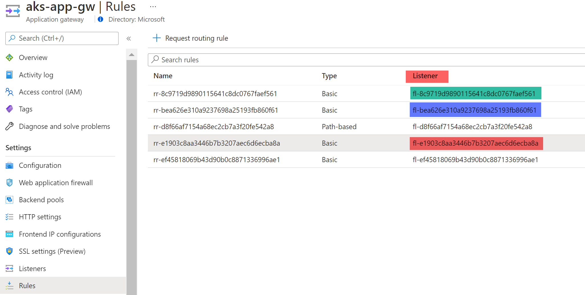
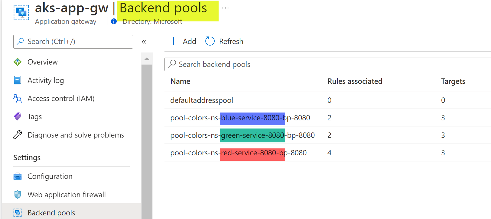
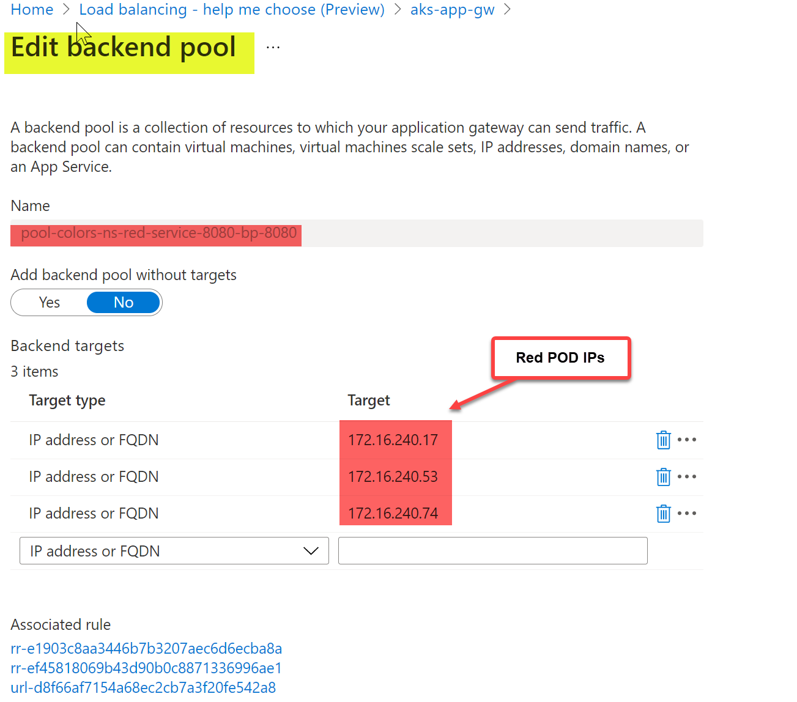
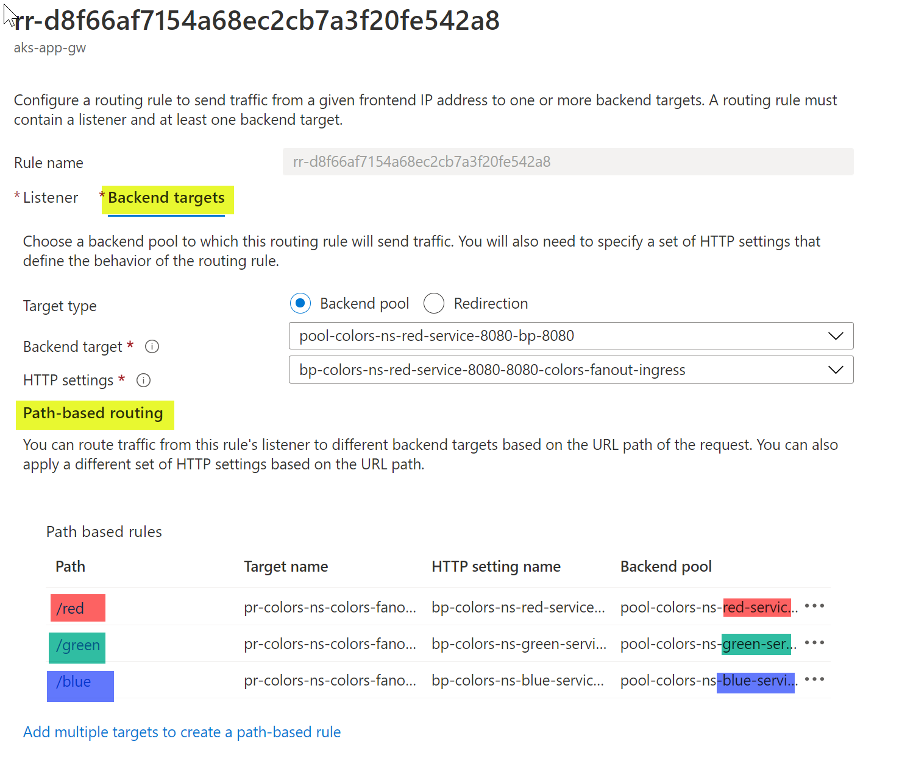
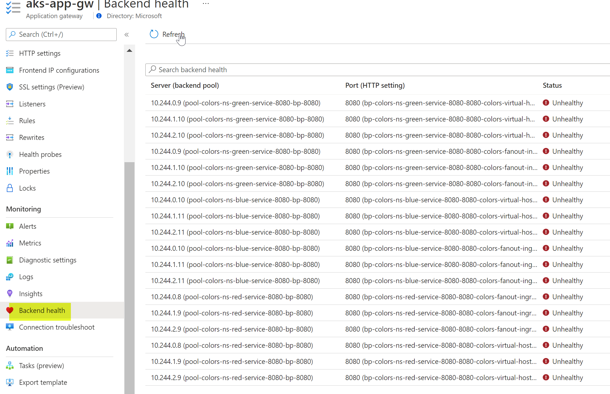
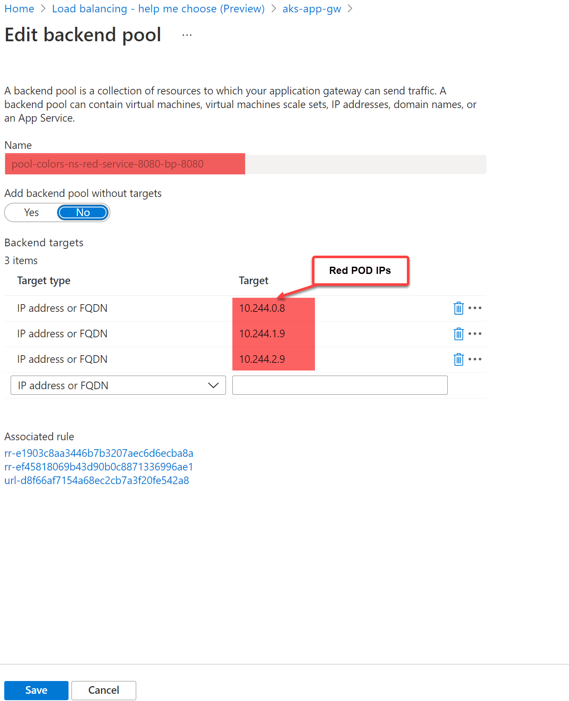

## Azure AKS Application Gateway Ingress Controller (AGIC)

This architecture demonstrates the connectivity architecture and traffic flows for using L7 load balancer to expose AKS services to the Internet. The Application Gateway Ingress Controller (AGIC) is a kubernetes application which make it possible for AKS customers to leverage Azure's native Application Gateway L7 load balancer. Application gateway talks to the pods using the their private IP (Azure CNI Network) and does not require NodePort services. This reduces one hop in the traffic flow

## Reference Architecture

### Application Gateway Ingress Contoller (AGIC) (Using Azure CNI Network)


Download Visio link here.

## Azure Documentation links

1. [Ingress For AKS](https://docs.microsoft.com/en-us/azure/application-gateway/ingress-controller-overview)
2. [Enable Ingress Controller add-on - Greenfield](https://docs.microsoft.com/en-us/azure/application-gateway/tutorial-ingress-controller-add-on-existing)
3. [Enable Ingress Controller add-on - Brownfield](https://docs.microsoft.com/en-us/azure/application-gateway/tutorial-ingress-controller-add-on-new)
4. [External Load Balancer](https://docs.microsoft.com/en-us/azure/aks/load-balancer-standard)
5. [Ingress Troubleshooting](https://azure.github.io/application-gateway-kubernetes-ingress/troubleshootings/troubleshooting-installing-a-simple-application/)

## Ingress Concepts

Some ingress concepts - detailed link [here](https://kubernetes.io/docs/concepts/services-networking/ingress/)

**Simple fanout**

A fanout configuration routes traffic from a single IP address to more than one Service, based on the HTTP URI being requested. An Ingress allows you to keep the number of load balancers down to a minimum. For example, a setup like:

```
foo.bar.com -> 178.91.123.132 ->
/ foo service1:4200
/ bar service2:8080

```

Fanout

http://akscolors.penguintrails.com

http://akscolors.penguintrails.com/red

http://akscolors.penguintrails.com/green

http://akscolors.penguintrails.com/blue

**Name based virtual hosting**

Name-based virtual hosts support routing HTTP traffic to multiple host names at the same IP address.

```
foo.bar.com --| |-> foo.bar.com service1:80
| 178.91.123.132 |
bar.foo.com --| |-> bar.foo.com service2:80

```

Virtual Host

http://aksred.penguintrails.com

http://aksgreen.penguintrails.com

http://aksblue.penguintrails.com

## Design Components and Planning

0. Only Supported in **Azure CNI Networking Mode** (See detailed explanation below)

1. [Benefits of Application Gateway](https://docs.microsoft.com/en-us/azure/application-gateway/ingress-controller-overview#benefits-of-application-gateway-ingress-controller)

   - AGIC helps eliminate the need to have another load balancer/public IP in front of the AKS cluster and avoids multiple hops in your datapath before requests reach the AKS cluster. Application Gateway talks to pods using their private IP directly and does not require NodePort or KubeProxy services. This also brings better performance to your deployments.

   - Ingress Controller is supported exclusively by Standard_v2 and WAF_v2 SKUs, which also brings you autoscaling benefits. Application Gateway can react in response to an increase or decrease in traffic load and scale accordingly, without consuming any resources from your AKS cluster.

   - Using Application Gateway in addition to AGIC also helps protect your AKS cluster by providing TLS policy and Web Application Firewall (WAF) functionality.

2. [L7 Features](https://docs.microsoft.com/en-us/azure/application-gateway/ingress-controller-overview#benefits-of-application-gateway-ingress-controller)
   AGIC is configured via the Kubernetes Ingress resource, along with Service and Deployments/Pods. It provides a number of features, leveraging Azure’s native Application Gateway L7 load balancer. To name a few:

   - URL routing
   - Cookie-based affinity
   - TLS termination
   - End-to-end TLS
   - Support for public, private, and hybrid web sites
   - Integrated web application firewall

3. [Helm deployment vs AKS Add-on](https://docs.microsoft.com/en-us/azure/application-gateway/ingress-controller-overview#difference-between-helm-deployment-and-aks-add-on)

There are two ways to deploy AGIC for your AKS cluster. The first way is through Helm; the second is through AKS as an add-on. The primary benefit of deploying AGIC as an AKS add-on is that it's much simpler than deploying through Helm. For a new setup, you can deploy a new Application Gateway and a new AKS cluster with AGIC enabled as an add-on in one line in Azure CLI. The add-on is also a fully managed service, which provides added benefits such as automatic updates and increased support. Both ways of deploying AGIC (Helm and AKS add-on) are fully supported by Microsoft. Additionally, the add-on allows for better integration with AKS as a first class add-on

## Enable AGIC

1. Create the Application Gateway in the same VNET as AKS cluster or in a peer VNET.
2. Enable AGIC from the Command line or Azure Portal

```
az aks enable-addons -n $AKSCLUSTER -g $RG -a ingress-appgw --appgw-id $AKS_APPGW_ID

```

Enable AGIC from Azure Portal


## Design Validations

#### Create a sample deployment

Create red,green and blue services and ingress using the YAML files link [here](https://github.com/nehalineogi/aks-app-gw-ingress)

```
#
# Create Namespace
kubectl create namespace colors-ns
#
# Deployments
#
kubectl apply -f red-deployment.yaml
kubectl apply -f green-deployment.yaml
kubectl apply -f blue-deployment.yaml
kubectl apply -f white-deployment.yaml
#
# Ingress
#
kubectl apply -f colors-fanout.yaml
kubectl apply -f colors-virtual-host.yaml

```

#### IP Address Assignment

```
 k get nodes,pods,service -o wide -n colors-ns
NAME                                     STATUS   ROLES   AGE    VERSION    INTERNAL-IP     EXTERNAL-IP   OS-IMAGE             KERNEL-VERSION     CONTAINER-RUNTIME
node/aks-nodepool1-38290826-vmss000000   Ready    agent   2d1h   v1.19.11   172.16.240.4    <none>        Ubuntu 18.04.5 LTS   5.4.0-1049-azure   containerd://1.4.4+azure
node/aks-nodepool1-38290826-vmss000001   Ready    agent   2d1h   v1.19.11   172.16.240.35   <none>        Ubuntu 18.04.5 LTS   5.4.0-1049-azure   containerd://1.4.4+azure
node/aks-nodepool1-38290826-vmss000002   Ready    agent   2d1h   v1.19.11   172.16.240.66   <none>        Ubuntu 18.04.5 LTS   5.4.0-1049-azure   containerd://1.4.4+azure

NAME                                    READY   STATUS    RESTARTS   AGE   IP              NODE                                NOMINATED NODE   READINESS GATES
pod/blue-deployment-d5ccf9445-khv98     1/1     Running   0          25m   172.16.240.36   aks-nodepool1-38290826-vmss000001   <none>           <none>
pod/blue-deployment-d5ccf9445-mstjq     1/1     Running   0          25m   172.16.240.94   aks-nodepool1-38290826-vmss000002   <none>           <none>
pod/blue-deployment-d5ccf9445-pwthf     1/1     Running   0          25m   172.16.240.18   aks-nodepool1-38290826-vmss000000   <none>           <none>
pod/green-deployment-59cfdc54fb-87b6k   1/1     Running   0          25m   172.16.240.37   aks-nodepool1-38290826-vmss000001   <none>           <none>
pod/green-deployment-59cfdc54fb-gpx6c   1/1     Running   0          25m   172.16.240.24   aks-nodepool1-38290826-vmss000000   <none>           <none>
pod/green-deployment-59cfdc54fb-msmzn   1/1     Running   0          25m   172.16.240.91   aks-nodepool1-38290826-vmss000002   <none>           <none>
pod/red-deployment-5f589f64c6-6tcnz     1/1     Running   0          25m   172.16.240.61   aks-nodepool1-38290826-vmss000001   <none>           <none>
pod/red-deployment-5f589f64c6-ghxqt     1/1     Running   0          25m   172.16.240.9    aks-nodepool1-38290826-vmss000000   <none>           <none>
pod/red-deployment-5f589f64c6-nksj9     1/1     Running   0          25m   172.16.240.76   aks-nodepool1-38290826-vmss000002   <none>           <none>

NAME                    TYPE        CLUSTER-IP       EXTERNAL-IP   PORT(S)    AGE   SELECTOR
service/blue-service    ClusterIP   10.101.124.26    <none>        8080/TCP   25m   app=blue
service/green-service   ClusterIP   10.101.36.232    <none>        8080/TCP   25m   app=green
service/red-service     ClusterIP   10.101.135.216   <none>        8080/TCP   25m   app=red

```

#### Fanout Ingress

```
k get ingress colors-fanout-ingress -n colors-ns
Warning: extensions/v1beta1 Ingress is deprecated in v1.14+, unavailable in v1.22+; use networking.k8s.io/v1 Ingress
NAME                    CLASS    HOSTS                         ADDRESS      PORTS   AGE
colors-fanout-ingress   <none>   akscolors.penguintrails.com   20.84.1.67   80      26m

k  describe ingress colors-fanout-ingress -n colors-ns
Warning: extensions/v1beta1 Ingress is deprecated in v1.14+, unavailable in v1.22+; use networking.k8s.io/v1 Ingress
Name:             colors-fanout-ingress
Namespace:        colors-ns
Address:          20.84.1.67
Default backend:  default-http-backend:80 (<error: endpoints "default-http-backend" not found>)
Rules:
  Host                         Path  Backends
  ----                         ----  --------
  akscolors.penguintrails.com
                               /red     red-service:8080 (172.16.240.61:8080,172.16.240.76:8080,172.16.240.9:8080)
                               /green   green-service:8080 (172.16.240.24:8080,172.16.240.37:8080,172.16.240.91:8080)
                               /blue    blue-service:8080 (172.16.240.18:8080,172.16.240.36:8080,172.16.240.94:8080)
                                        red-service:8080 (172.16.240.61:8080,172.16.240.76:8080,172.16.240.9:8080)
Annotations:                   appgw.ingress.kubernetes.io/backend-path-prefix: /
                               kubernetes.io/ingress.class: azure/application-gateway
Events:                        <none>

```

#### On Prem Testing (Fanout)

```
Access via Application gateway (public IP)
nehali@nehali-laptop:~$ dig akscolors.penguintrails.com +short
nnaksappgw.eastus.cloudapp.azure.com.
20.84.1.67
nehali@nehali-laptop:~$ curl http://akscolors.penguintrails.com/red
red
nehali@nehali-laptop:~$ curl http://akscolors.penguintrails.com/green
green
nehali@nehali-laptop:~$ curl http://akscolors.penguintrails.com/blue
blue
nehali@nehali-laptop:~$ curl http://akscolors.penguintrails.com
red


Directly access the PODs:
nehali@nehali-laptop:~$ curl http://172.16.240.61:8080
red
nehali@nehali-laptop:~$ curl http://172.16.240.9:8080
red
nehali@nehali-laptop:~$ curl http://172.16.240.76:8080
red

```

#### Virtual Host Ingress

```
k get ingress colors-virtual-host-ingress -n colors-ns
Warning: extensions/v1beta1 Ingress is deprecated in v1.14+, unavailable in v1.22+; use networking.k8s.io/v1 Ingress
NAME                          CLASS    HOSTS                                                                                       ADDRESS      PORTS   AGE
colors-virtual-host-ingress   <none>   aksred.penguintrails.com,aksgreen.penguintrails.com,aksblue.penguintrails.com + 1 more...   20.84.1.67   80      4m12s


 k describe ingress colors-virtual-host-ingress -n colors-ns
Warning: extensions/v1beta1 Ingress is deprecated in v1.14+, unavailable in v1.22+; use networking.k8s.io/v1 Ingress
Name:             colors-virtual-host-ingress
Namespace:        colors-ns
Address:          20.84.1.67
Default backend:  default-http-backend:80 (<error: endpoints "default-http-backend" not found>)
Rules:
  Host                        Path  Backends
  ----                        ----  --------
  aksred.penguintrails.com
                                 red-service:8080 (172.16.240.61:8080,172.16.240.76:8080,172.16.240.9:8080)
  aksgreen.penguintrails.com
                                 green-service:8080 (172.16.240.24:8080,172.16.240.37:8080,172.16.240.91:8080)
  aksblue.penguintrails.com
                                 blue-service:8080 (172.16.240.18:8080,172.16.240.36:8080,172.16.240.94:8080)
  *
                                 red-service:8080 (172.16.240.61:8080,172.16.240.76:8080,172.16.240.9:8080)
Annotations:                  appgw.ingress.kubernetes.io/backend-path-prefix: /
                              kubernetes.io/ingress.class: azure/application-gateway
Events:                       <none>

```

#### On Prem Testing (Virtual Host)

```
dig aksred.penguintrails.com +short
nnaksappgw.eastus.cloudapp.azure.com.
20.84.1.67
nehali@nehali-laptop:~$ curl http://aksred.penguintrails.com
red
nehali@nehali-laptop:~$ curl http://aksgreen.penguintrails.com
green
nehali@nehali-laptop:~$ curl http://aksblue.penguintrails.com
blue
nehali@nehali-laptop:~$ curl -I -H "Host:aksred.penguintrails.com" 20.84.1.67
HTTP/1.1 200 OK
Date: Mon, 19 Jul 2021 16:46:56 GMT
Content-Type: text/plain; charset=utf-8
Content-Length: 4
Connection: keep-alive
X-App-Name: http-echo
X-App-Version: 0.2.3

nehali@nehali-laptop:~$ curl  -H "Host:aksred.penguintrails.com" 20.84.1.67
red
nehali@nehali-laptop:~$ curl  -H "Host:aksred.penguintrails.com" nnaksappgw.eastus.cloudapp.azure.com
red

```

#### Application Gateway Validations

##### Front End Listners (Based on the host headers)



##### App GW Backend Pools (red, green and blue service)



##### Backed pods for red-pool



##### Path Based Routing Rule



## Load Balancer and App Gateway Co-existenace

Note LoadBalancer Service with External IP. Ingress services of the type Cluster-IP.

```
k get service,Ingress -n colors-ns
Warning: extensions/v1beta1 Ingress is deprecated in v1.14+, unavailable in v1.22+; use networking.k8s.io/v1 Ingress
NAME                             TYPE           CLUSTER-IP       EXTERNAL-IP     PORT(S)          AGE
service/blue-service             ClusterIP      10.101.223.65    <none>          8080/TCP         3m46s
service/blue-service-external    LoadBalancer   10.101.117.215   52.142.19.89    8080:30101/TCP   33s
service/green-service            ClusterIP      10.101.93.184    <none>          8080/TCP         3m49s
service/green-service-external   LoadBalancer   10.101.21.196    52.226.2.143    8080:31752/TCP   38s
service/red-service              ClusterIP      10.101.182.196   <none>          8080/TCP         4m3s
service/red-service-external     LoadBalancer   10.101.98.223    52.142.17.248   8080:32696/TCP   5m10s

NAME                                             CLASS    HOSTS                                                                                       ADDRESS         PORTS   AGE
ingress.extensions/colors-fanout-ingress         <none>   akscolors.penguintrails.com                                                                 104.211.0.182   80      3m40s
ingress.extensions/colors-virtual-host-ingress   <none>   aksred.penguintrails.com,aksgreen.penguintrails.com,aksblue.penguintrails.com + 1 more...   104.211.0.182   80


```

##### Validations

```
Load Balancer IPs (3 Different IPs)
nehali@nehali-laptop:~$ curl 52.142.19.89:8080
blue
nehali@nehali-laptop:~$ curl 52.142.17.248:8080
red
nehali@nehali-laptop:~$ curl 52.226.2.143:8080
green

Ingress Testing:

nehali@nehali-laptop:~$ dig +short akscolors.penguintrails.com
nnaksappgw.eastus.cloudapp.azure.com.
104.211.0.182
nehali@nehali-laptop:~$ dig +short  aksred.penguintrails.com
nnaksappgw.eastus.cloudapp.azure.com.
104.211.0.182

nehali@nehali-laptop:~$ curl akscolors.penguintrails.com/red
red
nehali@nehali-laptop:~$ curl akscolors.penguintrails.com/green
green
nehali@nehali-laptop:~$ curl akscolors.penguintrails.com/blue
blue
nehali@nehali-laptop:~$ curl aksred.penguintrails.com
red
nehali@nehali-laptop:~$ curl aksgreen.penguintrails.com
green
nehali@nehali-laptop:~$ curl aksblue.penguintrails.com
blue

```

#### Application Gateway with Kubenet Network (Not Supported)

```
k get nodes,pods,service,ingress -A | grep -i ingress
Warning: extensions/v1beta1 Ingress is deprecated in v1.14+, unavailable in v1.22+; use networking.k8s.io/v1 Ingress
kube-system   pod/ingress-appgw-deployment-5f49d4c468-ddcrc   1/1     Running   0          36m


k get nodes,pods,service,ingress -o wide -n colors-ns
Warning: extensions/v1beta1 Ingress is deprecated in v1.14+, unavailable in v1.22+; use networking.k8s.io/v1 Ingress
NAME                                     STATUS   ROLES   AGE   VERSION    INTERNAL-IP    EXTERNAL-IP   OS-IMAGE             KERNEL-VERSION     CONTAINER-RUNTIME
node/aks-nodepool1-62766439-vmss000000   Ready    agent   15d   v1.19.11   172.16.239.4   <none>        Ubuntu 18.04.5 LTS   5.4.0-1049-azure   containerd://1.4.4+azure
node/aks-nodepool1-62766439-vmss000001   Ready    agent   15d   v1.19.11   172.16.239.5   <none>        Ubuntu 18.04.5 LTS   5.4.0-1049-azure   containerd://1.4.4+azure
node/aks-nodepool1-62766439-vmss000002   Ready    agent   15d   v1.19.11   172.16.239.6   <none>        Ubuntu 18.04.5 LTS   5.4.0-1049-azure   containerd://1.4.4+azure

NAME                                    READY   STATUS    RESTARTS   AGE     IP            NODE                                NOMINATED NODE   READINESS GATES
pod/blue-deployment-d5ccf9445-4g7dw     1/1     Running   0          87s     10.244.0.10   aks-nodepool1-62766439-vmss000001   <none>           <none>
pod/blue-deployment-d5ccf9445-6njwz     1/1     Running   0          87s     10.244.1.11   aks-nodepool1-62766439-vmss000002   <none>           <none>
pod/blue-deployment-d5ccf9445-q7l64     1/1     Running   0          87s     10.244.2.11   aks-nodepool1-62766439-vmss000000   <none>           <none>
pod/green-deployment-59cfdc54fb-6fkp2   1/1     Running   0          91s     10.244.0.9    aks-nodepool1-62766439-vmss000001   <none>           <none>
pod/green-deployment-59cfdc54fb-hd88k   1/1     Running   0          91s     10.244.1.10   aks-nodepool1-62766439-vmss000002   <none>           <none>
pod/green-deployment-59cfdc54fb-m8m9j   1/1     Running   0          91s     10.244.2.10   aks-nodepool1-62766439-vmss000000   <none>           <none>
pod/red-deployment-5f589f64c6-djnz8     1/1     Running   0          2m33s   10.244.1.9    aks-nodepool1-62766439-vmss000002   <none>           <none>
pod/red-deployment-5f589f64c6-nrjsk     1/1     Running   0          2m33s   10.244.2.9    aks-nodepool1-62766439-vmss000000   <none>           <none>
pod/red-deployment-5f589f64c6-xv59t     1/1     Running   0          2m33s   10.244.0.8    aks-nodepool1-62766439-vmss000001   <none>           <none>

NAME                           TYPE           CLUSTER-IP       EXTERNAL-IP   PORT(S)          AGE     SELECTOR
service/blue-service           ClusterIP      10.101.246.124   <none>        8080/TCP         87s     app=blue
service/green-service          ClusterIP      10.101.59.114    <none>        8080/TCP         91s     app=green
service/red-service            ClusterIP      10.101.141.74    <none>        8080/TCP         2m13s   app=red
service/red-service-external   LoadBalancer   10.101.47.205    40.88.55.42   8080:32282/TCP   2m33s   app=red

NAME                                             CLASS    HOSTS                                                                                       ADDRESS         PORTS   AGE
ingress.extensions/colors-fanout-ingress         <none>   akscolors.penguintrails.com                                                                 104.211.0.182   80      60s
ingress.extensions/colors-virtual-host-ingress   <none>   aksred.penguintrails.com,aksgreen.penguintrails.com,aksblue.penguintrails.com + 1 more...   104.211.0.182   80

```

Application Gateway does not have routing to PODs inside the Cluster because PODs are not on the node network. All backend services showing unhealthy



Red POD IPs not reachable from Application Gateway


## TODO

1. nginx ingress - update and consolidate content from the old artcile [here](https://github.com/nehalineogi/aks-nginx-ingress)
