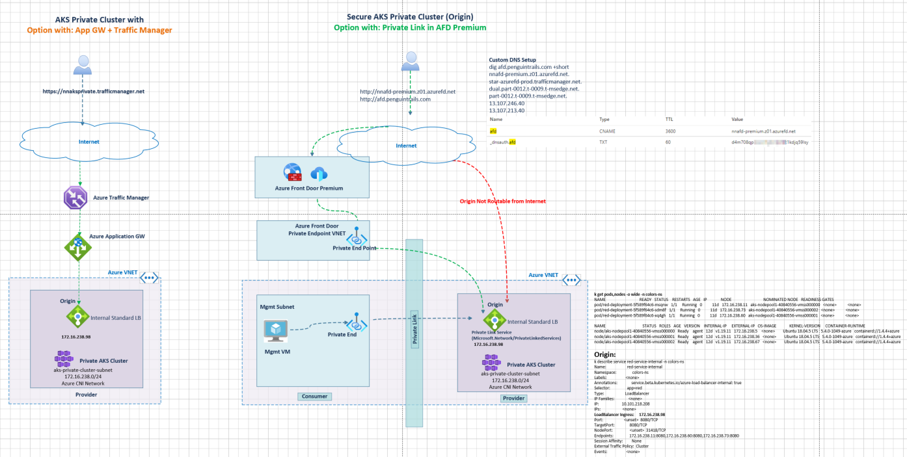
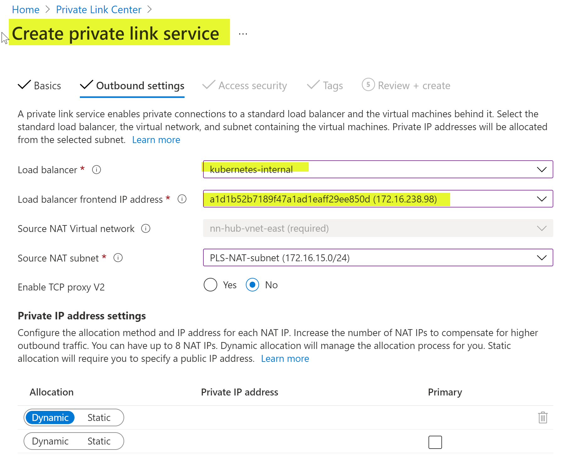
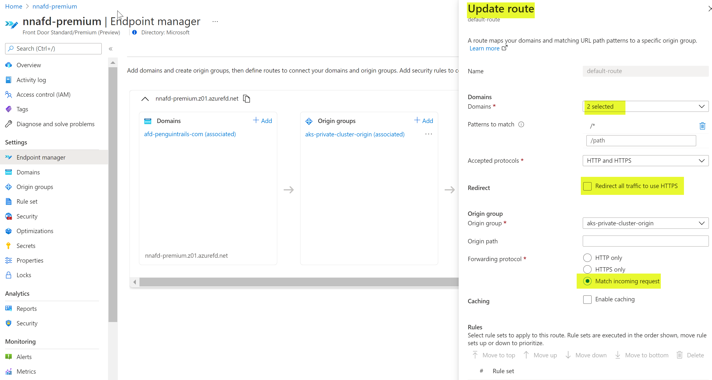
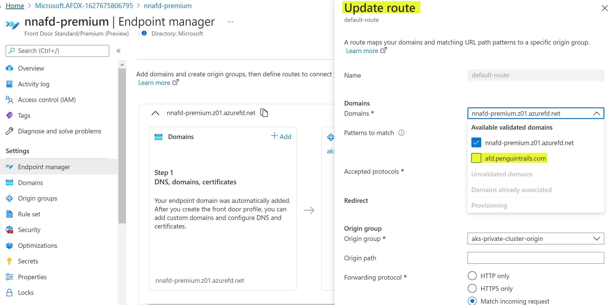
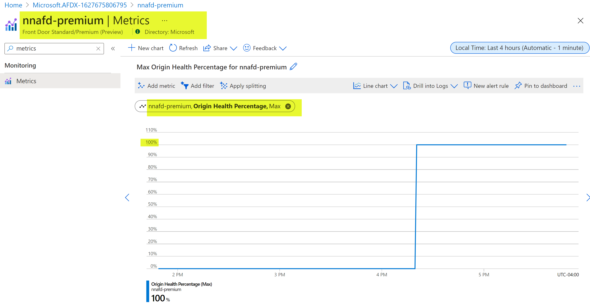

# Purpose

Review architecture options to expose AKS Private Cluster (Internal Load Balancer) ILB endpoint using global load balancer (Azure Traffic Manager vs Azure Front Door Premium)

# Architecture diagram

##### Option with Azure TM and Application Gateway

##### Option with Azure Front Door Premium and Private Link Service


[Dowload visio](../Visios/AFD-private-cluster.vsdx)

## Azure Documentation

[Azure Front Door Premium (Preview Service)](https://docs.microsoft.com/en-us/azure/frontdoor/standard-premium/)

[Secure Origin (AKS Internal Load Balancer) with Private Link in Azure Front](https://docs.microsoft.com/en-us/azure/frontdoor/standard-premium/concept-private-link)

## Use case and Design Considerations

- A private AKS cluster with global load balancing requirements
- Completely private AKS Cluster and using Azure Front door for ingress
- Replace Azure Azure Traffic Manager + Azure Application gateway with a single service using Azure Front Door

## Prerequisites

1. Kubernetes Private Cluster with ILB
2. **Azure Front Door Premium**
3. AKS Private Cluster in Azure
4. **Validate origin works**
   This origin is configured on Azure Internal Load balancer in front of the AKS Cluster.

```
curl  http://172.16.238.98:8080
red
```

Make sure the internal load balancer service is configured on the Private AKS Cluster.

```

k describe service red-service-internal -n colors-ns
Name:                     red-service-internal
Namespace:                colors-ns
Labels:                   <none>
Annotations:              service.beta.kubernetes.io/azure-load-balancer-internal: true
Selector:                 app=red
Type:                     LoadBalancer
IP Families:              <none>
IP:                       10.101.218.208
IPs:                      <none>
LoadBalancer Ingress:     172.16.238.98
Port:                     <unset>  8080/TCP
TargetPort:               8080/TCP
NodePort:                 <unset>  31418/TCP
Endpoints:                172.16.238.11:8080,172.16.238.60:8080,172.16.238.73:8080
Session Affinity:         None
External Traffic Policy:  Cluster
Events:                   <none>

```

## Private link Service (PLS) Workflow

#### Create Private Link Service for AKS Private Cluster Load Balancer Resource



#### View the Private Link Services

Note: No connection yet.


#### Add Origin in Azure Front Door (Note: Enable Private Endpoint)


#### Approve the Private Link service in PLS

Note: You'll receive an Azure Front Door private endpoint request for approval message at your origin. After you approve the request, a private IP address gets assigned from Front Door's virtual network, traffic between Azure Front Door and your origin traverses the established private link with Azure network backbone. Incoming traffic to your origin is now secured when coming from your Azure Front Doo


#### View the Private Link Services

Note: Once you enable a Private Link origin and approve the private endpoint connection, it takes a few minutes for the connection to be established. During this time, requests to the origin will receive a Front Door error message. The error message will go away once the connection is established.


#### Update A route to use the new PLS orgin



### Custom DNS Setup

**1. Create a custom domain**
Note: Domain will show pending until the validation is completed using the TXT record below.

**2. Create a txt record in your DNS Zone**

**3. Update the AFD route to reflect the new domain**


#### DNS Validations:

**Validate that origin works first**:

```
curl  http://172.16.238.98:8080
red

```

**Validate both the default and custom domains**

```
dig nnafd-premium.z01.azurefd.net +short
star-azurefd-prod.trafficmanager.net.
dual.part-0012.t-0009.t-msedge.net.
part-0012.t-0009.t-msedge.net.
13.107.246.40
13.107.213.40

dig afd.penguintrails.com +short
nnafd-premium.z01.azurefd.net.
star-azurefd-prod.trafficmanager.net.
dual.part-0012.t-0009.t-msedge.net.
part-0012.t-0009.t-msedge.net.
13.107.246.40
13.107.213.40


curl  http://nnafd-premium.z01.azurefd.net/
red
curl  http://afd.penguintrails.com
red

curl -I http://nnafd-premium.z01.azurefd.net/
HTTP/1.1 200 OK
Content-Length: 4
Content-Type: text/plain; charset=utf-8
Accept-Ranges: bytes
X-App-Name: http-echo
X-App-Version: 0.2.3
x-azure-ref: 0XGkEYQAAAAAU6w2jGH+bQYgkha8L0DW7Qk9TMzFFREdFMDQwNgA4Y2MwMWU0MS05YjYxLTRjNDItODExNi0wOWVjOTExZmFmOGI=
X-Cache: CONFIG_NOCACHE
X-Cache: CONFIG_NOCACHE
Date: Fri, 30 Jul 2021 21:04:28 GMT

```

#### Origin Health Validation

In case the front end web site does not load validate the origin health



#### TODO

1. Bring your own Certificates
2. Add AFD to the private cluster diagram to complete the full picture
