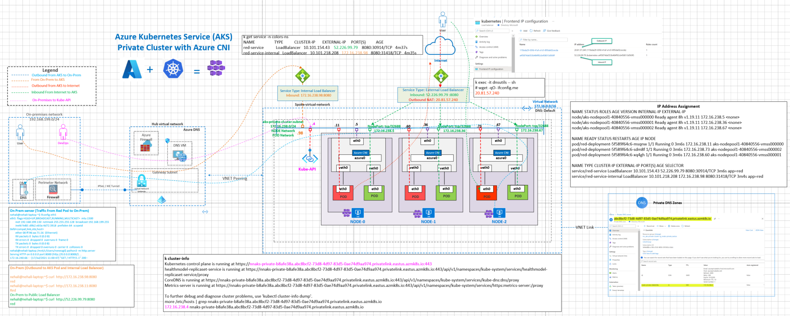
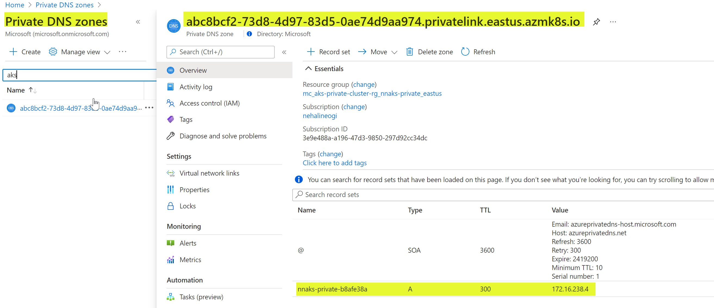

## Azure AKS Advanced/Azure CNI Networking

This architecture demonstrates the connectivity architecture and traffic flows connecting Azure AKS Private Cluster environment with your on-premises environment.

## Azure Documentation links

2. [Create Private Cluster](https://docs.microsoft.com/en-us/azure/aks/private-clusters)
3. [AKS Private Cluster limitations](https://docs.microsoft.com/en-us/azure/aks/private-clusters#limitations)
4. [External Load Balancer](https://docs.microsoft.com/en-us/azure/aks/load-balancer-standard)
5. [Internal Load Balancer](https://docs.microsoft.com/en-us/azure/aks/internal-lb)
6. [Configure Private DNS Zone](https://docs.microsoft.com/en-us/azure/aks/private-clusters#configure-private-dns-zone)

## Reference Architecture

### Advanced/Azure CNI Networking



Download Visio link here.

## Design Components and Planning

1. [AKS Advanced Networking](https://docs.microsoft.com/en-us/azure/aks/concepts-network#azure-cni-advanced-networking)
   The kubenet networking option is the default configuration for AKS cluster creation. With kubenet:

With Azure CNI, a common issue is the assigned IP address range is too small to then add additional nodes when you scale or upgrade a cluster. The network team may also not be able to issue a large enough IP address range to support your expected application demands. 3. Node/Pod Limits 4. On-Prem routing 5. DNS Design 6. Inbound IP via Azure Load Balancer 7. Outbound IP via Azure load Balancer
Unlike kubenet, traffic to endpoints in the same virtual network isn't NAT'd to the node's primary IP. The source address for traffic inside the virtual network is the pod IP. Traffic that's external to the virtual network still NATs to the node's primary IP.

2. [IP Address Calculations](https://docs.microsoft.com/en-us/azure/aks/)
   Azure CNI - that same basic /24 subnet range could only support a maximum of 8 nodes in the cluster
   This node count could only support up to 240 pods (with a default maximum of 30 pods per node with Azure CNI)up to 27,610 pods (with a default maximum of 110 pods per node with kubenet)

3. [External Load Balancer](https://docs.microsoft.com/en-us/azure/aks/load-balancer-standard)

Creates an Azure load balancer resource, configures an external IP address, and connects the requested pods to the load balancer backend pool. To allow customers' traffic to reach the application, load balancing rules are created on the desired ports.

Diagram showing Load Balancer traffic flow in an AKS cluster


4. [Internal Load Balancer](https://docs.microsoft.com/en-us/azure/aks/internal-lb)

If you'd like to specify IP address the the [link here](https://docs.microsoft.com/en-us/azure/aks/internal-lb#specify-an-ip-address)
If you would like to use a specific IP address with the internal load balancer, add the loadBalancerIP property to the load balancer YAML manifest. In this scenario, the specified IP address must reside in the same subnet as the AKS cluster and must not already be assigned to a resource. For example, you shouldn't use an IP address in the range designated for the Kubernetes subnet.

Check the [Prerequisites](https://docs.microsoft.com/en-us/azure/aks/configure-azure-cni)
The cluster identity used by the AKS cluster must have at least Network Contributor permissions on the subnet within your virtual network.

## Design Validations

1. Kube API Access

AKS Private DNS Zone get and Private endpoint gets created.



k cluster-info
Kubernetes control plane is running at https://nnaks-private-b8afe38a.abc8bcf2-73d8-4d97-83d5-0ae74d9aa974.privatelink.eastus.azmk8s.io:443
healthmodel-replicaset-service is running at https://nnaks-private-b8afe38a.abc8bcf2-73d8-4d97-83d5-0ae74d9aa974.privatelink.eastus.azmk8s.io:443/api/v1/namespaces/kube-system/services/healthmodel-replicaset-service/proxy
CoreDNS is running at https://nnaks-private-b8afe38a.abc8bcf2-73d8-4d97-83d5-0ae74d9aa974.privatelink.eastus.azmk8s.io:443/api/v1/namespaces/kube-system/services/kube-dns:dns/proxy
Metrics-server is running at https://nnaks-private-b8afe38a.abc8bcf2-73d8-4d97-83d5-0ae74d9aa974.privatelink.eastus.azmk8s.io:443/api/v1/namespaces/kube-system/services/https:metrics-server:/proxy

To further debug and diagnose cluster problems, use 'kubectl cluster-info dump'.
nehali@nehali-laptop:/mnt/c/Users/neneogi/Documents/repos/k8s/aks-azcli$ more /etc/hosts | grep nnaks-private-b8afe38a.abc8bcf2-73d8-4d97-83d5-0ae74d9aa974.privatelink.eastus.azmk8s.io
172.16.238.4 nnaks-private-b8afe38a.abc8bcf2-73d8-4d97-83d5-0ae74d9aa974.privatelink.eastus.azmk8s.io

2. IP Address Assignment

```
k get nodes,pods,service -o wide -n colors-ns
NAME                                     STATUS   ROLES   AGE   VERSION    INTERNAL-IP     EXTERNAL-IP   OS-IMAGE             KERNEL-VERSION     CONTAINER-RUNTIME
node/aks-nodepool1-40840556-vmss000000   Ready    agent   9h    v1.19.11   172.16.238.5    <none>        Ubuntu 18.04.5 LTS   5.4.0-1049-azure   containerd://1.4.4+azure
node/aks-nodepool1-40840556-vmss000001   Ready    agent   9h    v1.19.11   172.16.238.36   <none>        Ubuntu 18.04.5 LTS   5.4.0-1049-azure   containerd://1.4.4+azure
node/aks-nodepool1-40840556-vmss000002   Ready    agent   9h    v1.19.11   172.16.238.67   <none>        Ubuntu 18.04.5 LTS   5.4.0-1049-azure   containerd://1.4.4+azure

NAME                                  READY   STATUS    RESTARTS   AGE   IP              NODE                                NOMINATED NODE   READINESS GATES
pod/red-deployment-5f589f64c6-msqnw   1/1     Running   0          25m   172.16.238.11   aks-nodepool1-40840556-vmss000000   <none>           <none>
pod/red-deployment-5f589f64c6-sdm8f   1/1     Running   0          25m   172.16.238.73   aks-nodepool1-40840556-vmss000002   <none>           <none>
pod/red-deployment-5f589f64c6-xq4gh   1/1     Running   0          25m   172.16.238.60   aks-nodepool1-40840556-vmss000001   <none>           <none>

NAME                           TYPE           CLUSTER-IP       EXTERNAL-IP     PORT(S)          AGE   SELECTOR
service/red-service            LoadBalancer   10.101.154.43    52.226.99.79    8080:30914/TCP   25m   app=red
service/red-service-internal   LoadBalancer   10.101.218.208   172.16.238.98   8080:31418/TCP   25m   app=red

```

3. Node view

```
 k get pods -o wide
NAME       READY   STATUS    RESTARTS   AGE   IP              NODE                                NOMINATED NODE   READINESS GATES
dnsutils   1/1     Running   0          21m   172.16.238.27   aks-nodepool1-40840556-vmss000000   <none>           <none>
../kubectl-node_shell aks-nodepool1-40840556-vmss000000
spawning "nsenter-xecmko" on "aks-nodepool1-40840556-vmss000000"
If you don't see a command prompt, try pressing enter.
root@aks-nodepool1-40840556-vmss000000:/# ip add
1: lo: <LOOPBACK,UP,LOWER_UP> mtu 65536 qdisc noqueue state UNKNOWN group default qlen 1000
    link/loopback 00:00:00:00:00:00 brd 00:00:00:00:00:00
    inet 127.0.0.1/8 scope host lo
       valid_lft forever preferred_lft forever
    inet6 ::1/128 scope host
       valid_lft forever preferred_lft forever
2: eth0: <BROADCAST,MULTICAST,UP,LOWER_UP> mtu 1500 qdisc mq state UP group default qlen 1000
    link/ether 00:0d:3a:10:f2:71 brd ff:ff:ff:ff:ff:ff
    inet 172.16.238.5/24 brd 172.16.238.255 scope global eth0
       valid_lft forever preferred_lft forever
    inet6 fe80::20d:3aff:fe10:f271/64 scope link
       valid_lft forever preferred_lft forever
3: enP929s1: <BROADCAST,MULTICAST,SLAVE,UP,LOWER_UP> mtu 1500 qdisc mq master eth0 state UP group default qlen 1000
    link/ether 00:0d:3a:10:f2:71 brd ff:ff:ff:ff:ff:ff
5: azvca752574e53@if4: <BROADCAST,MULTICAST,UP,LOWER_UP> mtu 1500 qdisc noqueue state UP group default qlen 1000
    link/ether a6:25:90:3b:48:96 brd ff:ff:ff:ff:ff:ff link-netnsid 0
    inet6 fe80::a425:90ff:fe3b:4896/64 scope link
       valid_lft forever preferred_lft forever
7: azv7d81daa1243@if6: <BROADCAST,MULTICAST,UP,LOWER_UP> mtu 1500 qdisc noqueue state UP group default qlen 1000
    link/ether c6:cb:c1:a6:81:b9 brd ff:ff:ff:ff:ff:ff link-netnsid 1
    inet6 fe80::c4cb:c1ff:fea6:81b9/64 scope link
       valid_lft forever preferred_lft forever
13: azv82e43ff514a@if12: <BROADCAST,MULTICAST,UP,LOWER_UP> mtu 1500 qdisc noqueue state UP group default qlen 1000
    link/ether 66:6a:e6:78:c9:47 brd ff:ff:ff:ff:ff:ff link-netnsid 2
    inet6 fe80::646a:e6ff:fe78:c947/64 scope link
       valid_lft forever preferred_lft forever
15: azvb3c61c3cba9@if14: <BROADCAST,MULTICAST,UP,LOWER_UP> mtu 1500 qdisc noqueue state UP group default qlen 1000
    link/ether ca:2a:5b:e1:ff:3a brd ff:ff:ff:ff:ff:ff link-netnsid 3
    inet6 fe80::c82a:5bff:fee1:ff3a/64 scope link
       valid_lft forever preferred_lft forever
root@aks-nodepool1-40840556-vmss000000:/# route -n
Kernel IP routing table
Destination     Gateway         Genmask         Flags Metric Ref    Use Iface
0.0.0.0         172.16.238.1    0.0.0.0         UG    100    0        0 eth0
168.63.129.16   172.16.238.1    255.255.255.255 UGH   100    0        0 eth0
169.254.169.254 172.16.238.1    255.255.255.255 UGH   100    0        0 eth0
172.16.238.0    0.0.0.0         255.255.255.0   U     0      0        0 eth0
172.16.238.7    0.0.0.0         255.255.255.255 UH    0      0        0 azvca752574e53
172.16.238.11   0.0.0.0         255.255.255.255 UH    0      0        0 azv82e43ff514a
172.16.238.20   0.0.0.0         255.255.255.255 UH    0      0        0 azv7d81daa1243
172.16.238.27   0.0.0.0         255.255.255.255 UH    0      0        0 azvb3c61c3cba9
root@aks-nodepool1-40840556-vmss000000:/# cat /etc/resolv.conf
# This file is managed by man:systemd-resolved(8). Do not edit.
#
# This is a dynamic resolv.conf file for connecting local clients directly to
# all known uplink DNS servers. This file lists all configured search domains.
#
# Third party programs must not access this file directly, but only through the
# symlink at /etc/resolv.conf. To manage man:resolv.conf(5) in a different way,
# replace this symlink by a static file or a different symlink.
#
# See man:systemd-resolved.service(8) for details about the supported modes of
# operation for /etc/resolv.conf.

nameserver 168.63.129.16
search 1grit5g0qs5exa0hhgg2i425ng.bx.internal.cloudapp.net
root@aks-nodepool1-40840556-vmss000000:/# curl ifconfig.me
20.81.57.240

```

6. POD View

```
 k exec -it dnsutils -- sh
/ # ip add
1: lo: <LOOPBACK,UP,LOWER_UP> mtu 65536 qdisc noqueue state UNKNOWN qlen 1000
    link/loopback 00:00:00:00:00:00 brd 00:00:00:00:00:00
    inet 127.0.0.1/8 scope host lo
       valid_lft forever preferred_lft forever
    inet6 ::1/128 scope host
       valid_lft forever preferred_lft forever
14: eth0@if15: <BROADCAST,UP,LOWER_UP,M-DOWN> mtu 1500 qdisc noqueue state UP qlen 1000
    link/ether e6:88:11:21:35:69 brd ff:ff:ff:ff:ff:ff
    inet 172.16.238.27/24 scope global eth0
       valid_lft forever preferred_lft forever
    inet6 fe80::e488:11ff:fe21:3569/64 scope link
       valid_lft forever preferred_lft forever
/ # route -n
Kernel IP routing table
Destination     Gateway         Genmask         Flags Metric Ref    Use Iface
0.0.0.0         169.254.1.1     0.0.0.0         UG    0      0        0 eth0
169.254.1.1     0.0.0.0         255.255.255.255 UH    0      0        0 eth0
/ # cat /etc/resolv.conf
search default.svc.cluster.local svc.cluster.local cluster.local 1grit5g0qs5exa0hhgg2i425ng.bx.internal.cloudapp.net
nameserver 10.101.0.10
options ndots:5
/ # curl ifconfig.io
sh: curl: not found
/ # wget -qO- ifconfig.io
wget: error getting response: Network unreachable
/ # wget -qO- ifconfig.me
20.81.57.240

```

7. Traffic from On-Premises to Azure

```

On Prem server:
nehali@nehali-laptop:~$ ifconfig eth5
eth5: flags=4163<UP,BROADCAST,RUNNING,MULTICAST>  mtu 1500
        inet 192.168.199.130  netmask 255.255.255.128  broadcast 192.168.199.255
        inet6 fe80::d9b2:eb5a:4d72:3918  prefixlen 64  scopeid 0xfd<compat,link,site,host>
        ether 00:ff:96:aa:71:26  (Ethernet)
        RX packets 0  bytes 0 (0.0 B)
        RX errors 0  dropped 0  overruns 0  frame 0
        TX packets 0  bytes 0 (0.0 B)
        TX errors 0  dropped 0 overruns 0  carrier 0  collisions 0
nehali@nehali-laptop:~$ curl  http://172.16.238.98:8080
red
nehali@nehali-laptop:~$ curl  http://172.16.238.11:8080
red
nehali@nehali-laptop:~$ curl  http://52.226.99.79:8080
red


```

## Tools and Traffic Flows

1. kubectl command refernce
2. dnsutils pod (To run basic connectivity commands)
3. ssh into AKS nodes

```

```
