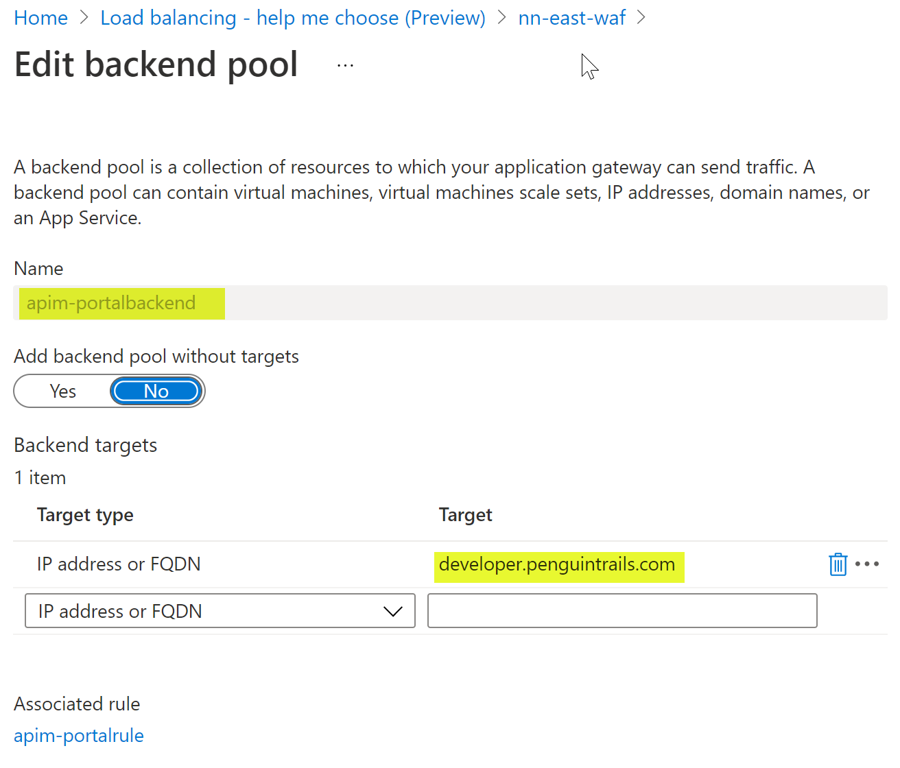
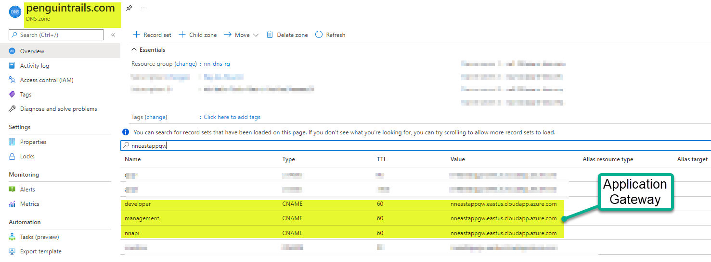

## Azure API Management (APIM) Internal Mode with Application Gateway

 APIM can be deployed in various modes. APIM in Internal Mode is accessible via private IP (172.16.6.9). APIM in Internal Mode can be deployed in conjunction with Application gateway for external access. This architecture diagram shows APIM in Internal Mode with Application gateway and Custom domains for APIM endpoints.

## Reference Architecture


## Azure Documentation links

1. [APIM internal Mode](https://docs.microsoft.com/en-us/azure/api-management/api-management-using-with-internal-vnet)
2. [APIM with Application Gateway](https://docs.microsoft.com/en-us/azure/api-management/api-management-using-with-internal-vnet)
3. [APIM Self Hosted Gateway](https://docs.microsoft.com/en-us/azure/api-management/self-hosted-gateway-overview)

## Design Components and Considerations:
0. **Traffic Flows**
   
   1. Blue/Cyan : Backend API Connections
   2. Green: Developer Portal Access from on-premises and External Consumers using custom domain
   3. Red: Developer Portal Access from Internet using default domain (Not allowed in Internal Mode)
   4. Purple: Self-hosted APIM Gateway on-premises outbound connection to APIM Management plane
   5. Note: VPN/Private Connectivity is optional. APIM endpoints are exposed on the application gateway.

1. APIM in Internal Mode is accessible via private IP (172.16.6.9) only. APIM in Internal Mode deployed in conjunction with Application gateway for external access to APIM endpoints.
   
2. VPN/Private Connectivity: External Consumers and developers would access the developer portal via application gateway. Note: With VPN connectivity, internal consumers can access the developer portal and APIM directly. See DNS considerations. **Self-hosted gateway will work with or without private connectivity** as long as management.penguintrails.com resolves correctly and is routable from on-premises.

  
3. In Internal Network mode, the DNS needs to be maintained and configured by the user. Custom domains using Azure Private DNS Zone and Public DNS can be leveraged. **Note: that Default DNS endpoints below not accessible from the internet in Internal Mode.**

```
Default Domains
https://nnapi.developer.azure-api.net
http://nnapi.azure-api.net
```

4. Custom domain and DNS Considerations


For external consumers, use custom domain with APIM.  DNS resovles to public IP of the application Gateway in this design. Note: If there is VPN between on-premises and Azure, DNS from on-premises can resolve to private IP addresses and in that scenario APIM is can be accesses directly. Developers and external consumers can contiune to use the public IP.

```

dig nnapi.penguintrails.com +short
nneastappgw.eastus.cloudapp.azure.com.
52.142.39.37
 dig developer.penguintrails.com +short
nneastappgw.eastus.cloudapp.azure.com.
52.142.39.37
dig management.penguintrails.com +short
nneastappgw.eastus.cloudapp.azure.com.
52.142.39.37

```

5. Backend APIs needs to be routable from APIM. If VPN is available, on-premises APIs will be reachable for Azure API. Otherwise, leverage self-hosted APIM gateway
   

6. The diagram shows Backend APIs running in Azure (AKS Cluster, Function App), externally hosted APIs (example weather API or conference API) and Backend API hosted on-premises

7.  Self-hosted Gateway Considerations  - 
   * Use Docker host or on-premises Kubernetes cluster to run API Management self-hosted gateway
   * Management.penguintrails.com DNS should resolve from on-premises or where the the gateway is hosted.
8.  Identity Considerations - Management.penguintrails.com should resolve correctly for AAD and B2C to work correctly.
9.  Application Gateway VNET is linked to Private DNS Zone for internal resolution of the custom domain.

# Pre-requisites
Using Azure documentation link [here](https://docs.microsoft.com/en-us/azure/api-management/import-and-publish) ensure that you've deployed APIM in the Internal Mode.

Refer to common documentation link [here](README-common.md) for more details on pre-requisites
1. APIM is deployed in Internal Mode.
2. Products, APIs and subscriptions created.
3. VPN or Private Connectivity is required in this design.
4. Internal and External APIs routable from APIM subnet.
5. Azure Provided default DNS resolution for API endpoints.
6. Developer Portal Published (Branding optional)
7. Troubleshooting Notes - [here](README-troubleshooting.md).


## Application Gateway Setup Snippets

Please refer to Azure documentation links for detailed implementation. These screen captures show a working configuration example:
### Front End IP Address


### Front End Listeners


### Backend Pools


### Developer Portal Pool. Note the target is resolved to 172.16.6.0 using private DNS zone.


### Private DNS Zone. Note: Application Gateway VNET is linked to the Private DNS Zone.


### Health Probes


### Rules


### Backend Health


### Public DNS for External Consumers. Note that it's a CNAME to application gateway DNS name.


## Validations

1. Using IP address of the application gateway and host header
   
    curl -I --location --request GET 'https://52.142.39.37/internal/ListUsers' --header 'Host: nnapi.penguintrails.com' 

2. Using Custom Domain  (Internal backend API)
   
      curl --location --request GET 'https://nnapi.penguintrails.com/internal/ListUsers'

3. Using Custom Domain (External Backend API)
   
    curl --location --request GET 'https://nnapi.penguintrails.com/conference/sessions' --header 'Ocp-Apim-Subscription-Key: 0a1b8bb1XXXXXXXXXXedd70d135'

4. **Using nnapi.azure-api.net (default domain) for external user fails.** Workaround is private/VPN connectivity with local hosts file as show below (also explained in detailed in the internal APIM article)

    curl --location --request GET 'https://nnapi.azure-api.net/echo/resource?param1=sample' \
--header 'Ocp-Apim-Subscription-Key: XXXXX135'

```

172.16.6.9 nnapi.azure-api.net
172.16.6.9 nnapi.portal.azure-api.net
172.16.6.9 nnapi.developer.azure-api.net
172.16.6.9 nnapi.management.azure-api.net
172.16.6.9 nnapi.scm.azure-api.net

```


## Self-hosted Gateway

### Azure Portal side Configuration and Validation


### On-premises side: env.conf and docker run commands
```
config.service.endpoint=https://management.penguintrails.com/subscriptions/XXXXX/resourceGroups/nn-api-rg/providers/Microsoft.ApiManagement/service/nnapi?api-version=2021-01-0
1-preview
config.service.auth=GatewayKey nnapi-internal-self-hosted-gw&202109291210&XXXXXXXXXXXXXXXXXXXXXXXXXXXXXXXXXXXX2BNxUvXSimgHo2jfSLvYXXXXXXXX

docker run -d -p 6001:8080 -p 6002:8081 --name nnapi-internal-self-hosted-gw --env-file env.conf mcr.mi
crosoft.com/azure-api-management/gateway:latest

```

### Validations:
```
docker ps
CONTAINER ID   IMAGE                                                   COMMAND                  CREATED      STATUS      PORTS
  NAMES
2ec68d21b845   mcr.microsoft.com/azure-api-management/gateway:latest   "/bin/sh -c 'dotnet …"   5 days ago   Up 5 days   0.0.0.0:6001->8080/tcp, :::6001->8080/tcp, 0.0.0.0:6002->8081/tcp, :::6002->8081/tcp   nnapi-internal-self-hosted-gw

 docker exec -it 2e sh
/app $ netstat -ant | grep 39.37
tcp        0      0 172.17.0.2:45936        52.142.39.37:443        ESTABLISHED

```

Connection to APIM management plane and DNS resolution for the management.penguintrails.com

```
 docker exec -it 2e sh
/app $ netstat -ant | grep 39.37
tcp        0      0 172.17.0.2:45936        52.142.39.37:443        ESTABLISHED

/app $ nslookup management.penguintrails.com
Server:         192.168.65.5
Address:        192.168.65.5:53

Non-authoritative answer:
management.penguintrails.com    canonical name = nneastappgw.eastus.cloudapp.azure.com
Name:   nneastappgw.eastus.cloudapp.azure.com
Address: 52.142.39.37
Name:   nneastappgw.eastus.cloudapp.azure.com
Address: 52.142.39.37

Non-authoritative answer:
management.penguintrails.com    canonical name = nneastappgw.eastus.cloudapp.azure.com


Non-authoritative answer:
/app $ netstat -ant | grep 39.37
tcp        0      0 172.17.0.2:45936        52.142.39.37:443        ESTABLISHED
/app $

```

