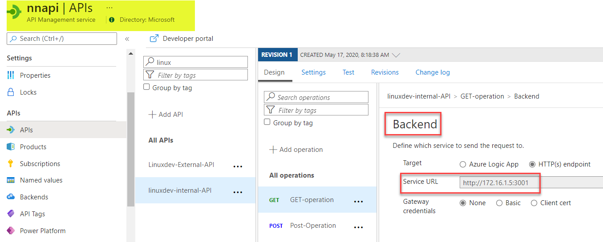
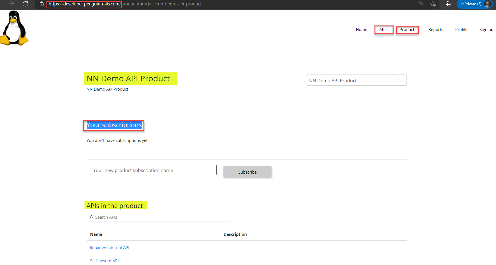
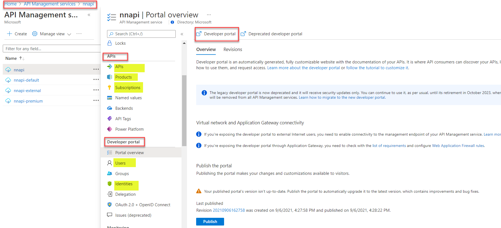
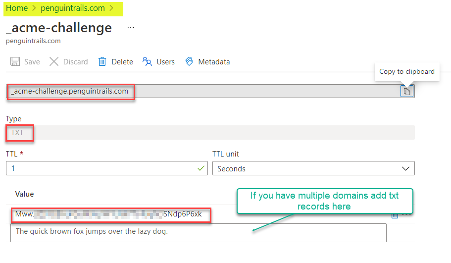
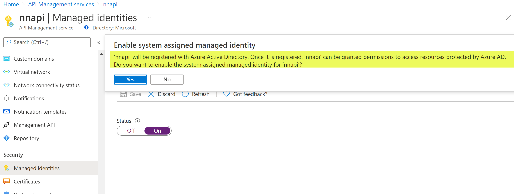
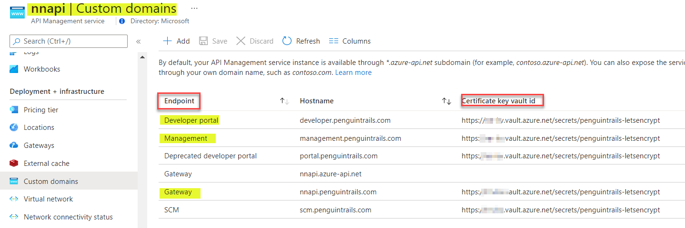

# Azure API Management (APIM) - Big Picture View

This architecture shows the big picture view of Azure API Management (APIM) and introduction to the terminology and common design components used in different sections of this series. This reference architecture also demonstrates the high level placement of APIM in different modes (Internal,External and Default/None). The main focus of this series is the different networking modes which are detailed out in seperate sections throughout the series.

# Reference Architecture


# Azure Documentation links

1. [APIM External Mode](https://docs.microsoft.com/en-us/azure/api-management/api-management-using-with-vnet)
2. [APIM Internal Mode](https://docs.microsoft.com/en-us/azure/api-management/api-management-using-with-internal-vnet)
3. [Terminology](https://docs.microsoft.com/en-us/azure/api-management/api-management-terminology)

# Design Components and Terminology

# APIM Endpoints
Note: APIM creates a secure facade for your APIs. The varios sevice endpoints with APIM are listed below. Default service endpoints are registered in public DNS for External and Default mode. N**one of the service endpoints are registered on public DNS in internal mode.**

Example:

```
API Gateway :           nnapi-default.azure-api.net

API Legacy Portal:      nnapi-default.portal.azure-api.net

API Developer Portal:   nnapi-default.developer.azure-api.net

API Management Endpoint nnapi-default.management.azure-api.net

API Git                 nnapi-default.scm.azure-api.net


```

# Backend API

A backend in APIM is an HTTP service that implements the CRUD operations. This could run in Azure PaaS services like AKS, Azure Functions or Azure logic Apps. This could also run on a IaaS VM in Azure or on-premises.  The backend API URLs are referenced in the APIs created with APIM.




# Products

APIM Products contains one or more APIs. Developers subscribe to products using the developer portal and cosume the APIs.


# Subscriptions
In APIM, API consumers access APIs using subscription keys. Azure documentation link [here](https://docs.microsoft.com/en-us/azure/api-management/api-management-subscriptions)




# APIM Network Modes

This section is the key area of focus for the series of reference architectures. Each of these modes are detailed out in next sections.

**Default/None mode**: This mode **does not integrate with an Azure VNET**. APIM Endpoints are accessible from the internet.

**Internal Mode**:  APIM is deployed in an Azure subnet and has a virtual IP (VIP) in the APIM subnet. APIM Endpoints are not accessible from the Intenet but accessible within the VNET and over a private connection. APIM can access backend APIs within the VNETs and over the private connection to an on-premises datacenter.  Note: Use APIM with application gateway for inbound public access to APIM endpoints.

**External Mode**: APIM is deployed in an Azure subnet. APIM endpoints are accessible from the public internet. Backend APIs and resources are accessible within the VNET and using a private connection.

Example:

 

# Developer/Consumer Portal
Developer portal is used by consumers (developers) to access the APIs. Developer portal can be customized. Developer portal is exposed via private IP in case of the internal mode APIM. DNS considerations apply.

 

# Azure Portal

Azure portal is used by the administrator to configure and manage an APIM PaaS service

 

# LetsEncrypt Certificates and Custom Domain

APIM endpoints by default have Azure managed DNS using azure-api.net subdomain. In this example we expose these endpoints using a custom domain - penguintrails.com. The example below shows how to create a valid letencrypt certificate and use Azure Key Vault to store the certificates. 

1. Install Certbot utility link [here](https://github.com/certbot/certbot/releases/tag/v1.19.0)
2. Create a wildcard certificate. (Note: For individual certificates add more domains after -d)
In Powershell:

certbot certonly --manual --preferred-challenges dns -d *.penguintrails.com

Navigate to c:\certbot and validate.


3. Create DNS Record
   
   

4. Convert the certificate to .pfx format
   
Example in WSL environment:
From :  /mnt/c/Certbot/live/penguintrails.com/

```
     openssl pkcs12 -export -inkey privkey.pem -in cert.pem -certfile chain.pem -out penguintrails-letsencrypt.pfx

```     
    ** Note: These certificates are valid for 90 days**

```
     penguintrails-letsencrypt.pfx -nokeys | openssl x509 -noout -startdate -enddate
     
     Enter Import Password:
     
     notBefore=Jul 23 20:23:54 2021 GMT
     notAfter=Oct 21 20:23:52 2021 GMT


```

5. Enable Managed Identity
    

6. Import the Certificate to Azure keyvault
   
    
     

7. Add a custom domain for each of the APIM endpoints (developer portal, management, gateway, scm and legacy portal(if needed))
       

# Custom Domain and DNS Considerations
APIM in Internal Mode DNS is managed by the user. APIM in External Mode Default DNS resolution is provided by Azure DNS. For Custom Domain, the user needs to do the manage DNS configuration.
Azure Private and public DNS zone can be leveraged.

```
#APIM default domain
#
172.16.6.9 nnapi.azure-api.net
172.16.6.9 nnapi.portal.azure-api.net
172.16.6.9 nnapi.developer.azure-api.net
172.16.6.9 nnapi.management.azure-api.net
172.16.6.9 nnapi.scm.azure-api.net
##
#APIM custom domain
#
172.16.6.9 nnapi.penguintrails.com
172.16.6.9 developer.penguintrails.com
172.16.6.9 portal.penguintrails.com
172.16.6.9 management.penguintrails.com
172.16.6.9 scm.penguintrails.com

```

# Other Design Components
Please refer to specific article in this series for more details on other design components

1. Identity Components (AAD and B2C)
2. APIM Internal Mode with Application Gateway
3. APIM with Azure Firewall
4. APIM Multi-region
5. Postman Collection

