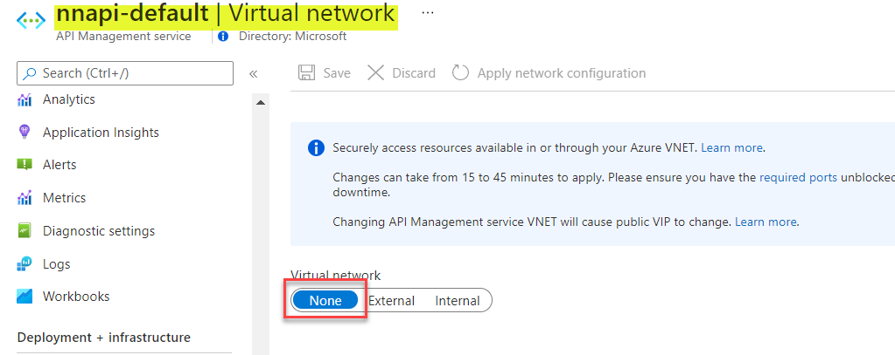
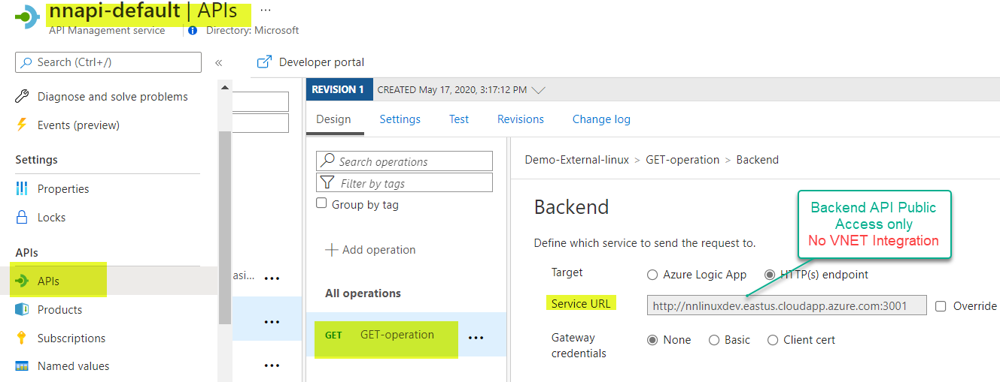

## Azure API Management (APIM) Default Mode

This architecture demonstrates the connectivity architecture and traffic flows to devloper portal, API gateway and other management endpoints with APIM. APIM can be deployed in various modes. The diagram shows APIM in default virtual network mode which is set to "none". APIM in default mode has direct access from the internet **and no VNET integration**. This is a simple mode for POC/lab scenarios. Custom domain, identity and self-hosted gateways can be configured for all the three network models.

## Reference Architecture


## Azure Documentation links

1. [APIM default Mode](https://docs.microsoft.com/en-us/azure/api-management/api-management-using-with-vnet)
2. [APIM Mode](https://docs.microsoft.com/en-us/azure/api-management/virtual-network-concepts?tabs=stv2#access-options)


## Design Components

1. APIM In default/none mode has **No VNET integration**
2. **Traffic Flows**
   
   1. Blue/Cyan : Backend API Connections
   2. Green: Developer Portal and API Gateway Access from on-premises and from Internet
   3. Red: No VPN to on-premises
   4. Purple: Self-hosted APIM Gateway (on-premises) outbound connection to APIM Management plane in Azure


3. Default DNS: APIM in default mode is accessible from the internet. Note : VPN connectivity to on-premises is not needed (it's optional). Default DNS Resolution is provided by Azure DNS

**APIM default Mode default hostnames**
Note: All resolve to APIM VIP - public IP: 13.92.61.44

```
API Gateway :           nnapi-default.azure-api.net

API Legacy Portal:      nnapi-default.portal.azure-api.net

API Developer Portal:   nnapi-default.developer.azure-api.net

API Management Endpoint nnapi-default.management.azure-api.net

API Git                 nnapi-default.scm.azure-api.net


```
4. **DNS Custom domain considerations:** 
   
   APIM default mode is accessible from the internet. Default DNS Resolution is provided by Azure DNS. Note: APIM custom domain with user managed DNS is also supported.

```
nehali@nehali-laptop:~$ dig nnapi-default.azure-api.net +short
apimgmttmzfww0wltfuueps93irupzxtaibxw84vu9beio67ug.trafficmanager.net.
nnapi-default-eastus-01.regional.azure-api.net.
apimgmthswl9re3lmxzql1trcem4vhzns3wi7pgownizflvlit.cloudapp.net.
13.92.61.44
nehali@nehali-laptop:~$ dig nnapi-default.developer.azure-api.net +short
apimgmthswl9re3lmxzql1trcem4vhzns3wi7pgownizflvlit.cloudapp.net.
13.92.61.44
nehali@nehali-laptop:~$ dig nnapi-default.management.azure-api.net +short
apimgmthswl9re3lmxzql1trcem4vhzns3wi7pgownizflvlit.cloudapp.net.
13.92.61.44
```
5. Backend APIs need to be pubicly accessible (Example Echo API, Conference API or API running on linux host with** public IP address**)


6. Self hosted Gateway Consideration:
   * Use Docker host or on-premises Kubernetes cluster to run API Management self-hosted gateway
   * Backend APIs (192.168.1.232) needs to be routable from self-hosted APIM Gateway within the on-premises environment. Management.penguintrails.com resolves to public IP of the APIM (13.92.61.44)


# Pre-requisites

Using Azure documentation link [here](https://docs.microsoft.com/en-us/azure/api-management/import-and-publish) ensure that you've deployed APIM in the default mode.

Refer to common documentation link [here](README-common.md) for more details on pre-requisites
1. APIM in deployed in default/none mode.
2. Products, APIs and subscriptions created
3. VPN or Private Connectivity is not applicable in this design.
4. External APIs only
5. Azure Provided default DNS resolution for API endpoints.
6. Developer Portal Published
7. Troubleshooting Notes - [here](README-troubleshooting.md).


# Validations:


1. Base validations from Azure Portal
   
   
   

2. From on-premises validate connection to External IP (Echo API). 

      Default Domain:

      curl --location --request GET 'https://nnapi-default.azure-api.net/echo/resource?param1=sample' --header 'Ocp-Apim-Subscription-Key: XXXX01'

   

3. From on-premises validate connection to an External API hosted on a Linux VM in Azure (**Note backend API connection is via Public IP only**)

   Default Domain

   curl --location --request GET 'http://nnapi-default.azure-api.net/public/listUsers' --header 'Ocp-Apim-Subscription-Key: XXXX35'

  
  

4. Verify Developer Portal Access
    
    Access developer Portal via Private Window using https://nnapi-default.developer.azure-api.net.  Developer portal resolves to a public IP. Navigate to API and products.  API call will fail because of the subscription key requirement. You'll need to register to see subscriptions.


   
4.   Packet Capture on backend API server to validate the source IP of the APIM.  Note: No VNET Integration.



```
Sample API listening on private and public IP address on Azure linux VM for demo:
nehali@nn-linux-dev:~/api$ node app.js
Example app listening at http://:::3001


Note: APIM Source: 13.92.61.44  (backend api access via public IP)
root@nn-linux-dev:~# tcpdump -ni eth0 port 3001
tcpdump: verbose output suppressed, use -v or -vv for full protocol decode
listening on eth0, link-type EN10MB (Ethernet), capture size 262144 bytes
21:52:54.195761 IP 13.92.61.44.1025 > 172.16.1.5.3001: Flags [SEW], seq 876968126, win 64240, options [mss 1440,nop,wscale 8,nop,nop,sackOK], length 0
21:52:54.195843 IP 172.16.1.5.3001 > 13.92.61.44.1025: Flags [S.], seq 2676058308, ack 876968127, win 64240, options [mss 1460,nop,nop,sackOK,nop,wscale 7], length 0
21:52:54.197465 IP 13.92.61.44.1025 > 172.16.1.5.3001: Flags [.], ack 1, win 16425, length 0
21:52:54.197465 IP 13.92.61.44.1025 > 172.16.1.5.3001: Flags [P.], seq 1:328, ack 1, win 16425, length 327
21:52:54.197525 IP 172.16.1.5.3001 > 13.92.61.44.1025: Flags [.], ack 328, win 501, length 0
21:52:54.198572 IP 172.16.1.5.3001 > 13.92.61.44.1025: Flags [P.], seq 1:409, ack 328, win 501, length 408
21:52:54.211815 IP 13.92.61.44.1025 > 172.16.1.5.3001: Flags [.], ack 409, win 16423, length 0

```


## API Self-hosted Gateway

1. Deploy Gateway in Portal 


2. Add APIs via Azure Portal


3. Deploy Gateway on an Premises Docker host (in this example running on WSL linux) using the env.conf and the docker run command

 
Note: Adjust the listening port per your environment. Default is 80 and 443. In this example it's changed to 9001 and 9002.

```

more env.conf
config.service.endpoint=https://nnapi-default.management.azure-api.net/subscript
ions/XXXXX/resourceGroups/nn-api-rg/providers/Mic
rosoft.ApiManagement/service/nnapi-default?api-version=2021-01-01-preview
config.service.auth=GatewayKey nnapi-default-self-hosted-gw&202110XXXXX


docker run -d -p 9001:8080 -p 9002:8081 --name nnapi-default-self-hosted-gw --en
v-file env.conf mcr.microsoft.com/azure-api-management/gateway:latest

```


```

nehali@nehali-laptop:~$ docker ps
CONTAINER ID   IMAGE                                                   COMMAND                  CREATED        STATUS                  PORTS
                                                              NAMES
f5273499ff3b   mcr.microsoft.com/azure-api-management/gateway:latest   "/bin/sh -c 'dotnet …"   1 second ago   Up Less than a second   0.0.0.0:9001->8080/tcp, :::9001->8080/tcp, 0.0.0.0:9002->8081/tcp, :::9002->8081/tcp   nnapi-default-self-hosted-gw
nehali@nehali-laptop:~$ docker exec -it f5 sh
/app $ hping -S -p 443 nnapi-default.management.azure-api.net
HPING nnapi-default.management.azure-api.net (eth0 13.92.61.44): S set, 40 headers + 0 data bytes
len=44 ip=13.92.61.44 ttl=37 id=2060 sport=443 flags=SA seq=0 win=65535 rtt=39.7 ms
^C
--- nnapi-default.management.azure-api.net hping statistic ---
1 packets tramitted, 1 packets received, 0% packet loss
round-trip min/avg/max = 39.7/39.7/39.7 ms
/app $ netstat -ant | grep 13.92
tcp        0      0 172.17.0.2:41544        13.92.61.44:443         ESTABLISHED
tcp       93      0 172.17.0.2:41546        13.92.61.44:443         ESTABLISHED
tcp        0      0 172.17.0.2:41554        13.92.61.44:443         ESTABLISHED
/app $

```
4. Validate self-hosted gateway container is running and online. For any troubleshooting of the container, use the following command:
   
```
docker logs 04 --follow

```

5. Validate local API running on 192.168.1.232

```
   1. On 192.168.1.232
    node app.js
Server started on port 3001...
Mysql Connected...

   2. Test local api connection using curl or postman
        
        curl --location --request GET 'https://127.0.0.1:9002/self/api/products' --header 'Ocp-Apim-Subscription-Key: e888XXXXXX'
        curl --location --request GET 'https://127.0.0.1:9002/echo/resource?param1=sample' --header 'Ocp-Apim-Subscription-Key: e888XXXX'

   3. Review Self hosted container logs:
   docker logs 04 --follow


```   
Successful Connection:

```
[Info] 2021-09-14T11:00:01.607, isRequestSuccess: True, totalTime: 17, category: GatewayLogs, callerIpAddress: 172.17.0.1, timeGenerated: 09/14/2021 23:00:01, region: eastus-onprem, correlationId: ecaf6b37-65cd-41bf-92f2-c370958feb55, method: GET, url: https://127.0.0.1:9002/self/api/products, backendResponseCode: 200, responseCode: 200, responseSize: 627, cache: none, backendTime: 8, apiId: self-hosted-api, operationId: wsl-linux-get-products, apimSubscriptionId: all-apis, clientProtocol: HTTP/1.1, backendProtocol: HTTP/1.1, apiRevision: 1, clientTlsVersion: 1.2, backendMethod: GET, backendUrl: http://192.168.1.232:3001/api/products

```   
