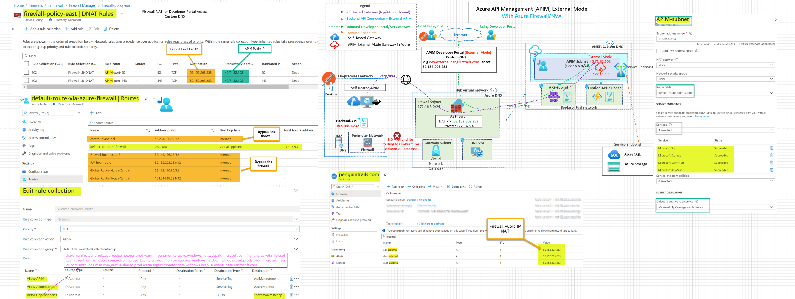
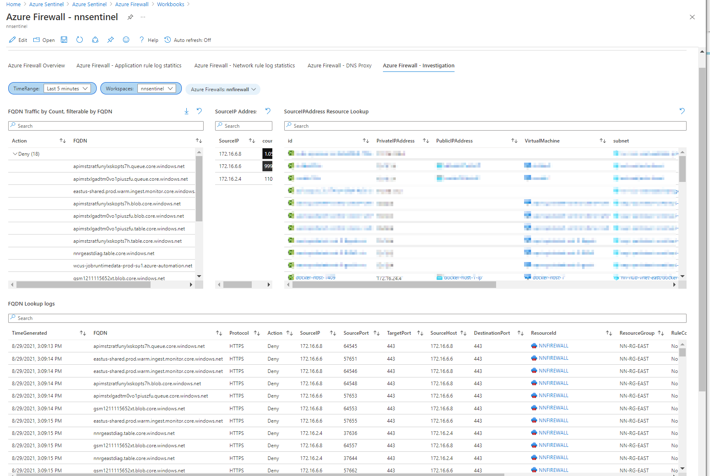
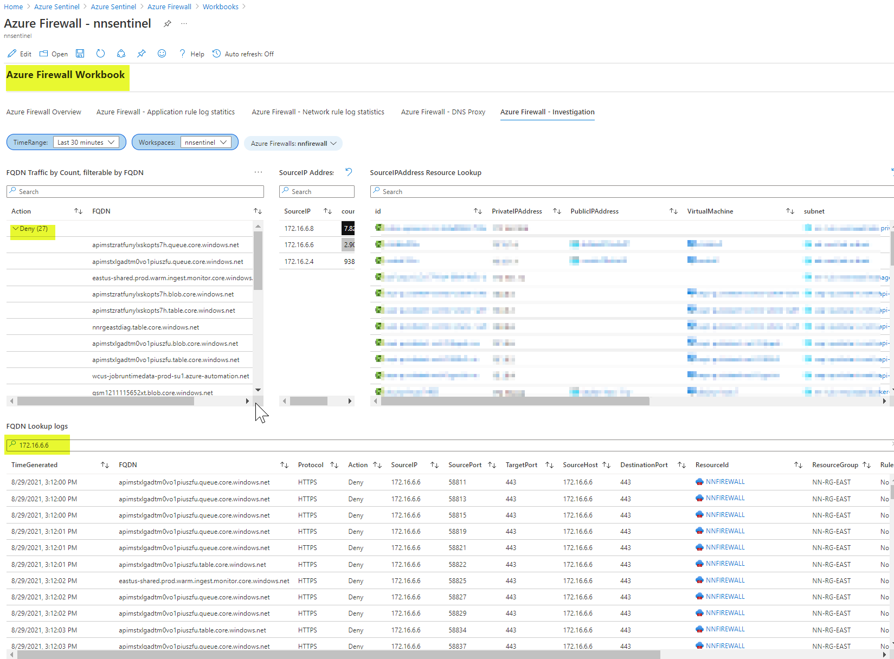
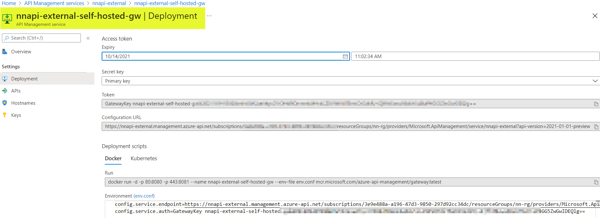

# Azure API Management (APIM) with NVA/Azure firewall

This architecture demonstrates the connectivity architecture and traffic flows to API Management (APIM) endpoints using Azure firewall/NVA. APIM can be deployed in various modes. The diagram shows APIM in external mode and Azure firewall/NVA in the desgin. 

# Azure Documentation links

1. [APIM External Mode](https://docs.microsoft.com/en-us/azure/api-management/api-management-using-with-vnet)
2. [APIM Internal Mode](https://docs.microsoft.com/en-us/azure/api-management/api-management-using-with-internal-vnet)
3. [Forced Tunneling with APIM](https://docs.microsoft.com/en-us/azure/api-management/api-management-using-with-vnet?tabs=stv2#force-tunneling-traffic-to-on-premises-firewall-using-expressroute-or-network-virtual-appliance)
4. [Control Plane IP](https://docs.microsoft.com/en-us/azure/api-management/api-management-using-with-vnet?tabs=stv2#control-plane-ip-addresses)
5. [Azure Load Balancer in Premium Tier](https://docs.microsoft.com/en-us/azure/api-management/api-management-using-with-vnet?tabs=stv2#azure-load-balancer)
6.  [Assymetric Routing Issue with Standard Load Balancer Design](https://docs.microsoft.com/en-us/azure/firewall/integrate-lb#asymmetric-routing)
   

# Reference Architecture




# Pre-requisites
Using Azure documentation link [here](https://docs.microsoft.com/en-us/azure/api-management/import-and-publish) ensure that you've external APIM in the external mode.

Refer to common documentation link [here](README-common.md) for more details on pre-requisites
1. APIM in deployed in External mode.
2. Products,APIs and subscriptions created
3. VPN or Private Connectivity is optional in this design
4. Internal and External APIs routable from APIM subnet
5. Azure Provided default DNS resolution for API endpoints.
6. Developer Portal Published
7. Troubleshooting Notes - [here](README-troubleshooting.md).


## Design Components

0. **Traffic Flows**
   
   1. Blue/Cyan : Backend API Connections
   2. Green: Developer Portal and API Gateway Access from Internet lands on the Azure firewall
   3. Red: No VPN to On-premises
   4. Purple: Self-hosted APIM Gateway(On-Premises) outbound connection to APIM Management plane in Azure
   5. Service Endpoints Connection


1. Main difference between external mode APIM and this architecture is the firewall/NVA consideration
   
2. APIM in External mode is accessible from the internet. Note : VPN connectivity to on-premises is not needed (it's optional). External DNS Resolution works for the default domain

**APIM External Mode default hostnames**
Note: All resolve to public IP: 40.71.32.102. However in this use case with firewall/NVA Custom DNS is required and should point to the firewall front end public IP address: 52.152.203.253. See DNS considerations below.

```
API Gateway nnapi-external.azure-api.net

API Legacy Portal nnapi-external.portal.azure-api.net

API Developer Portal nnapi-external.developer.azure-api.net

API Management Endpoint nnapi-external.management.azure-api.net

API Git nnapi-external.scm.azure-api.net


```
3. Backend APIs needs to be routable from APIM in internal mode.
4. Use Docker host or On-Premises Kubernetes cluster to run API Management self hosted gateway
5. The diagram shows Backend APIs running in Azure (AKS Cluster, Function App), externally hosted APIs (example weather API or conference API) and Backend API hosted on-premises

5. Internal APIs hosted On-premises and in Azure (AKS or Azure Functions)
6. External API (Echo and Conference APIs)
7. Self hosted Gateway Consideration: Backend APIs (192.168.1.232) needs to be routable from Self hosted APIM Gateway within the on-premises environment. Management.penguintrails.com resolves to public IP.
8. When there is a firweall/NVA deployed in Azure VNET, there will be an Assymetric Routing Issue and you will see an error to connect to the management endpoint.

 

   
[Assymetric Routing Issue with Standard Load Balancer Design](https://docs.microsoft.com/en-us/azure/firewall/integrate-lb#asymmetric-routing)

When firewall or NVA is deployed in conjuction with the Azure Load balancer assymetric routing issue occurs when a APIM subnet has a default route going to the firewall's private IP address. In this case, the incoming traffic to the APIM is received via load balancer public IP address, but the return path goes through the firewall's private IP address. Since the firewall is stateful, it drops the returning packet because the firewall isn't aware of such an established session. The way to fix the assymetric routing issue is to create a NAT rule on the firewall pointing to the Load balancer IP for Ingress traffic and create a UDR for the firewall public IP to bypass the firewall for the return traffic.

**From Azure Documentation link [here](https://docs.microsoft.com/en-us/azure/firewall/integrate-lb#asymmetric-routing):**


9. Workaround for Assymetric Routing
    
    [Control Plane IP](https://docs.microsoft.com/en-us/azure/api-management/api-management-using-with-vnet?tabs=stv2#control-plane-ip-addresses) should be configured to bypass the firewall.

 

10. Enable Service Endpoints for the following services for optimal routing.

Azure SQL
Azure Storage
Azure Event Hub
Azure Key Vault (v2 platform)

 

11. Configure firewall/NVA to allow all APIM dependency traffic

**Full list of DNS names:**
shavamanifestcdnprod1.azureedge.net,qos.prod.warm.ingest.monitor.core.windows.net,wdcpalt.microsoft.com,flighting.cp.wd.microsoft.com,client.wns.windows.com,wdcp.microsoft.com,gcs.prod.monitoring.core.windows.net,login.windows.net,prod3.prod.microsoftmetrics.com,smtpi-co1.msn.com,eastus-shared.prod.warm.ingest.monitor.core.windows.net,v10.events.data.microsoft.com


  

12. **DNS Custom domain considerations:** APIM External mode is accessible from the internet. APIM Public DNS is setup and Custom domain is deployoed with Letsencrypt Certificates in the keyvault. Custom domain points to the firewall public IP address


   
   

```
nehali@nehali-laptop:~$  dig +short api-external.penguintrails.com
52.152.203.253
nehali@nehali-laptop:~$ dig +short dev-external.penguintrails.com
52.152.203.253
nehali@nehali-laptop:~$ dig +short mgt-external.penguintrails.com
52.152.203.253


```

# APIM and Firewall Configuration snippets


1. Firewall DNAT Rule


2. APIM Subnet Route table and Service endpoint configuration
   
 

3. Firewall deny logs troubleshooting using sentinel 
   




4. Use APIM network conectivity status to troubleshoot further erros
   
  

5. Azure firewall rules
   
  

**Full list of DNS names:**
shavamanifestcdnprod1.azureedge.net,qos.prod.warm.ingest.monitor.core.windows.net,wdcpalt.microsoft.com,flighting.cp.wd.microsoft.com,client.wns.windows.com,wdcp.microsoft.com,gcs.prod.monitoring.core.windows.net,login.windows.net,prod3.prod.microsoftmetrics.com,smtpi-co1.msn.com,eastus-shared.prod.warm.ingest.monitor.core.windows.net,v10.events.data.microsoft.com


   
# Validations

1. Via Firewall using host header (Note: firewall IP 52.152.203.253 NAT'd to APIM External Mode IP:public: 40.71.32.102  )

    curl --location --request GET 'https://52.152.203.253/conference/sessions' --header 'Ocp-Apim-Subscription-Key: XXXXea' --header 'Host: api-external.penguintrails.com'

2. With Custom Domain


  curl --location --request GET 'http://api-external.penguintrails.com/internal/listUsers' --header 'Ocp-Apim-Subscription-Key: XXXXea' 

3. Conference API
    curl --location --request GET 'http://api-external.penguintrails.com/internal/listUsers' --header 'Ocp-Apim-Subscription-Key: XXXXea'


## API Self Hosted Gateway

1. Deploy Gateway in Portal 




2. Add APIs


3. Deploy Gateway on Prem using the env.conf and the docker run command

 
```

env.conf

config.service.endpoint=https://mgt-external.penguintrails.com/subscriptions/XXXXX/resourceGroups/nn-rg/providers/Microsoft.ApiManagement/service/nnapi-external?api-version=20
21-01-01-preview
config.service.auth=GatewayKey nnapi-external-self-hosted-gw&202110141447&xVXXXX


docker run -d -p 7001:8080 -p 7002:8081 --name nnapi-external-self-hosted-gw --env-file env.conf mcr.mi
crosoft.com/azure-api-management/gateway:latest

```

Adjust the listening port per your environment. Default is 80 and 443. In this example it's change to 6001 and 6002.

```

docker ps
CONTAINER ID   IMAGE                                                   COMMAND                  CREATED        STATUS                  PORTS
                NAMES
53821ee66f8b   mcr.microsoft.com/azure-api-management/gateway:latest   "/bin/sh -c 'dotnet …"   1 second ago   Up Less than a second   0.0.0.0:7001->8080/tcp, :::7001->8080/tcp, 0.0.0.0:7002->8081/tcp, :::7002->8081/tcp   nnapi-external-self-hosted-gw
nehali@nehali-laptop:~$ docker exec -it 53 sh
/app $  hping -S -p 443 mgt-external.penguintrails.com
HPING mgt-external.penguintrails.com (eth0 52.152.203.253): S set, 40 headers + 0 data bytes
len=44 ip=52.152.203.253 ttl=37 id=15621 sport=443 flags=SA seq=0 win=65535 rtt=39.8 ms
DUP! len=40 ip=52.152.203.253 ttl=37 id=9562 sport=443 flags=SA seq=0 win=65535 rtt=719.8 ms
^C
--- mgt-external.penguintrails.com hping statistic ---
1 packets tramitted, 2 packets received, -100% packet loss
round-trip min/avg/max = 39.8/379.8/719.8 ms
/app $ netstat -ant | grep 203.253
tcp        0      0 172.17.0.2:38910        52.152.203.253:443      ESTABLISHED
tcp        0      0 172.17.0.2:38912        52.152.203.253:443      ESTABLISHED


```
4. Validate self hosted gateway container is running and online. For any troubleshooting the container use the following command:
   
```
docker logs 53 --follow

```

5. Validate local api running on 192.168.1.232

   1. On 192.168.1.232
    node app.js
Server started on port 3001...
Mysql Connected...

   2. Test local api connection using curl or postman
        
        curl --location --request GET 'https://127.0.0.1:7002/self/api/products' --header 'Ocp-Apim-Subscription-Key: XXXXea'

   3. Self hosted container logs:

Successful Connection:
   
```
 [Info] 2021-09-14T02:58:55.494, isRequestSuccess: True, totalTime: 32, category: GatewayLogs, callerIpAddress: 172.17.0.1, timeGenerated: 09/14/2021 14:58:55, region: nn-onprem-east, correlationId: 022d5382-61ee-4658-bdb1-73271f3414cd, method: GET, url: https://127.0.0.1:7002/self/api/products, backendResponseCode: 200, responseCode: 200, responseSize: 627, cache: none, backendTime: 17, apiId: self-hosted-api, operationId: wsl-linux-get-products, apimSubscriptionId: nehali-all-product-subscription, clientProtocol: HTTP/1.1, backendProtocol: HTTP/1.1, apiRevision: 1, clientTlsVersion: 1.2, backendMethod: GET, backendUrl: http://192.168.1.232:3001/api/products

```   

Container logs for a failed Connection (In case the backend API is not running)


```
[Info] 2021-09-14T02:59:23.892, isRequestSuccess: False, totalTime: 2104, category: GatewayLogs, callerIpAddress: 172.17.0.1, timeGenerated: 09/14/2021 14:59:23, region: nn-onprem-east, correlationId: 2bbf232e-0757-472c-8f69-5ae6466aa2c2, method: GET, url: https://127.0.0.1:7002/self/api/products, responseCode: 500, responseSize: 191, cache: none, apiId: self-hosted-api, operationId: wsl-linux-get-products, apimSubscriptionId: nehali-all-product-subscription, clientProtocol: HTTP/1.1, apiRevision: 1, clientTlsVersion: 1.2, lastError: {
  "elapsed": 2094,
  "source": "request-forwarder",
  "path": "forward-request\\forward-request",
  "reason": "BackendConnectionFailure",
  "message": "LogError connecting to 192.168.1.232:3001",
  "section": "backend",
  "transportErrorCode": 111
}, errors: [
  {
    "elapsed": 2079,
    "source": "request-forwarder",
    "path": "forward-request\\forward-request",
    "message": "LogError connecting to 192.168.1.232:3001",
    "section": "backend"
  }
]

```
6. Validate External API.

   curl --location --request GET 'https://127.0.0.1:7002/echo/resource?param1=sample' --header 'Ocp-Apim-Subscription-Key: XXXXXa2ea'


5. If routing to Azure hosted backend API is not available you'll get a 500 error
{
    "statusCode": 500,
    "message": "Internal server error",
    "activityId": "0339670b-a3fa-4ea7-b709-56a319db58b9"
}

[Info] 2021-09-14T05:22:11.328, isRequestSuccess: False, totalTime: 20035, category: GatewayLogs, callerIpAddress: 172.17.0.1, timeGenerated: 09/14/2021 17:22:11, region: nn-onprem-east, correlationId: 0339670b-a3fa-4ea7-b709-56a319db58b9, method: GET, url: https://127.0.0.1:7002/self/listUsers, responseCode: 500, responseSize: 191, cache: none, apiId: self-hosted-api, operationId: get-all-products, apimSubscriptionId: nehali-all-product-subscription, clientTime: 2, clientProtocol: HTTP/1.1, apiRevision: 1, clientTlsVersion: 1.2, lastError: {
  "elapsed": 20022,
  "source": "request-forwarder",
  "path": "forward-request\\forward-request",
  "reason": "BackendConnectionFailure",
  "message": "connection timed out: 172.16.1.5:3001",
  "section": "backend"
}, errors: [
  {
    "elapsed": 20020,
    "source": "request-forwarder",
    "path": "forward-request\\forward-request",
    "message": "connection timed out: 172.16.1.5:3001",
    "section": "backend"
  }
]
