# APIM Developer Portal Identity Integration

This architecture shows how to enable access to the developer portal using both Azure AD (AAD B2B) and Azure AD B2C. Includes screen captures showing the overall sign in experience.

# Reference Architecture
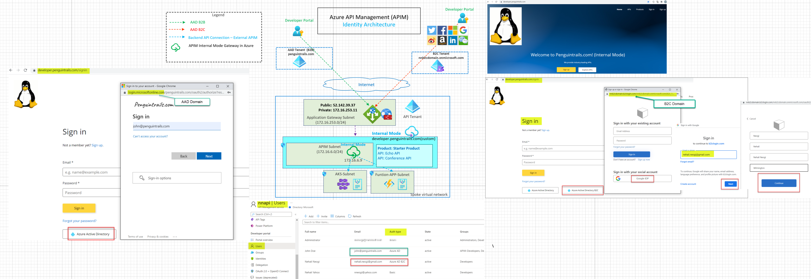
Download [Multi-tab Visio](APIM-all-reference-architectures-visio.vsdx) and [PDF](APIM-all-reference-architectures-PDF.pdf)

# Azure Documentation

[AAD Dev Portal Integration](https://docs.microsoft.com/en-us/azure/api-management/api-management-howto-aad)

[B2C Dev Portal Integration](https://docs.microsoft.com/en-us/azure/api-management/api-management-howto-aad-b2c)

# Design Components and Considerations

0. **Traffic Flows**
   
   1. Blue/Cyan : Backend API Connections
   2. Green: Developer Portal Sign in experience using AAD
   3. Red: Developer Portal Sign-in experience  using B2C
  

1. Note: The above diagram shows the APIM internal mode with Application gateway but it can be used with External and Default mode as well. Detailed implementation of [internal](README-internal.md) and [external](README-external.md) is explained in previous sections in this series.
2. Basic Authentication is the default methad the is available with API Management.
3. AAD Auth allows access to the developer portal from users from Azure AD or Corporate AD accounts sync'd to AAD using Azure AD Connect
4. AAD B2C Auth (Requires Premium Tier)
5. There are three different tenants
   1. AAD Tenant(Custom Domain: penguintrails.com, default domain: xxxx.onmicrosoft.com)
   2. B2C Tenant (nnb2cdomain.onmicrosoft.com) associated with AAD tenant(penguintrails.com)
   3. Tenant where APIM resources are deployed.

# Pre-requisites
Using Azure documentation link [here](https://docs.microsoft.com/en-us/azure/api-management/import-and-publish) ensure that you've external APIM in the internal mode.

Refer to common documentation link [here](README-common.md) for more details on pre-requisites
1. APIM in deployed in internal mode.
2. Products,APIs and subscriptions created
3. VPN or Private Connectivity is optional in this design
4. Internal and External APIs routable from APIM subnet
5. Azure Provided default DNS resolution for API endpoints.
6. Developer Portal Published
7. Troubleshooting Notes - [here](README-troubleshooting.md).

# Basic Auth

This method is the default method that comes with API management and is based on Username and Password.

## APIM Side (Default Configuration)

## User Experience is as follows:

#### When accessing developer portal the user gets a sign in page
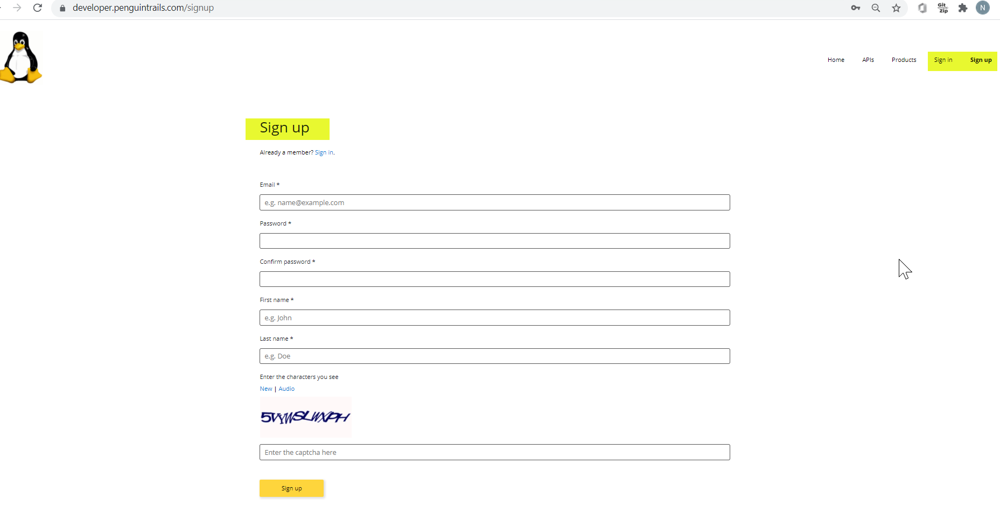

## Confirmation Email goes to the user email ID

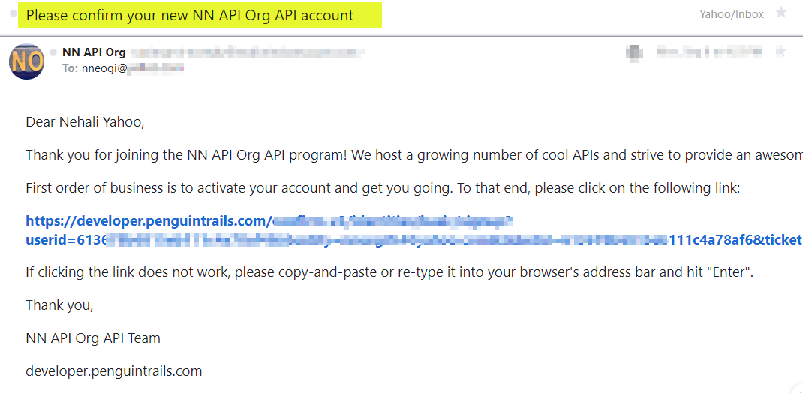

## User gets automatically added in APIM

# Azure AD

## APIM Side Configuration

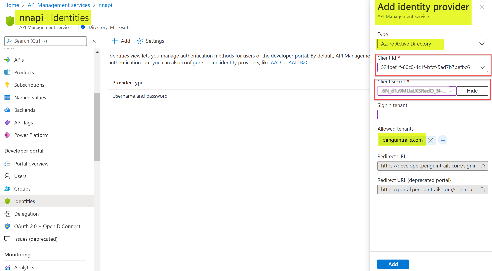

## Azure AD Tenant side Configuration

### Register the application

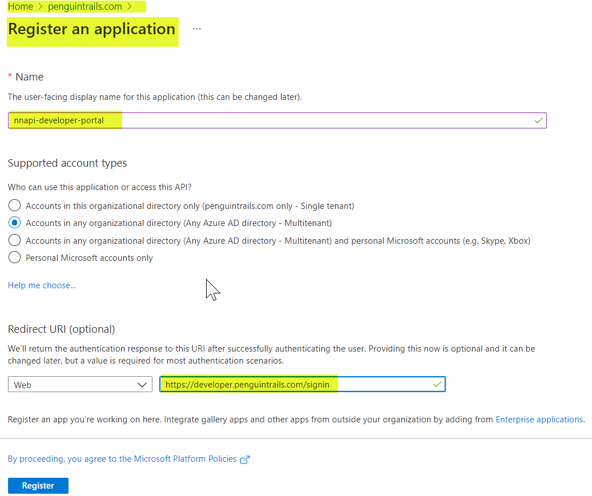
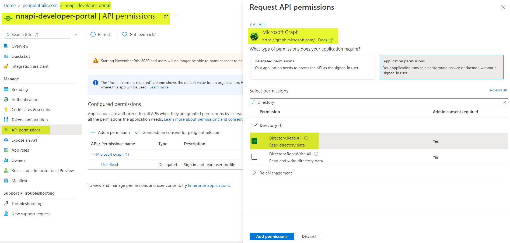

### Import the AAD Group

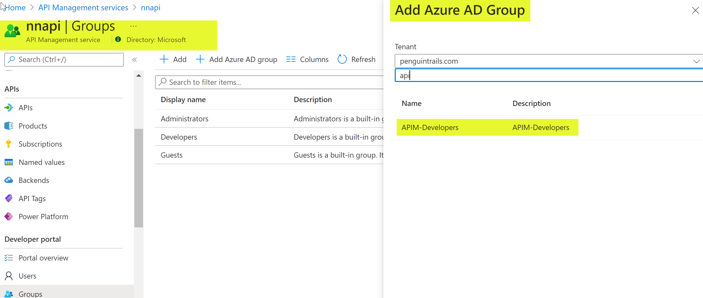
#### If permissions are not setup correctly it will result in this error
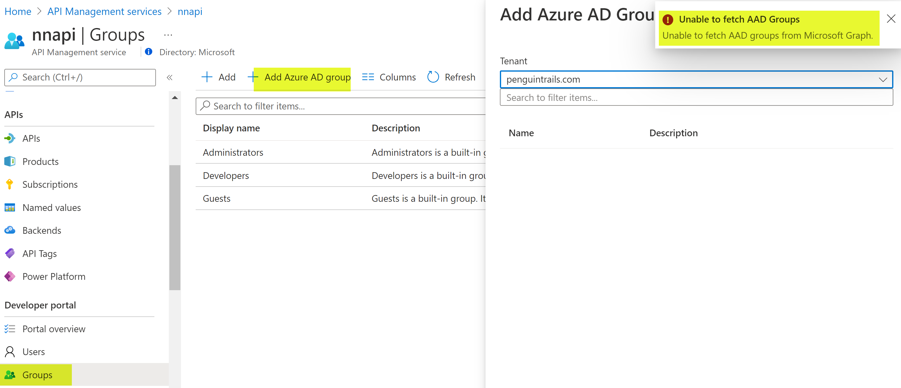

## AAD User Experience
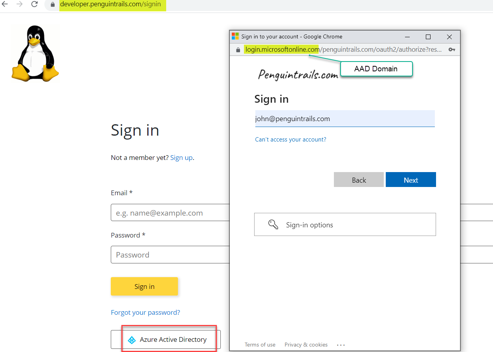
## User is automatically added in APIM

# Azure AD B2C

## Azure Documentation
[AAD Dev Portal Integration](https://docs.microsoft.com/en-us/azure/api-management/api-management-howto-aad-b2c)
[AAD Dev Portal Integration](https://docs.microsoft.com/en-us/azure/active-directory-b2c/secure-api-management?tabs=app-reg-ga)

## Pre-requisites
Make sure the following prequisites are completed. More documentation here.

[Azure AD B2C tenant](https://docs.microsoft.com/en-us/azure/active-directory-b2c/tutorial-create-tenant)

[Application registered in your tenant](https://docs.microsoft.com/en-us/azure/active-directory-b2c/tutorial-register-applications?tabs=app-reg-ga)

[User flows created in your tenant](https://docs.microsoft.com/en-us/azure/active-directory-b2c/tutorial-create-user-flows?pivots=b2c-user-flow)
	
[Published API in Azure API Management](https://docs.microsoft.com/en-us/azure/api-management/import-and-publish)

## An Azure AD B2C tenant

## Signup and Signin User flows that are created in your tenant

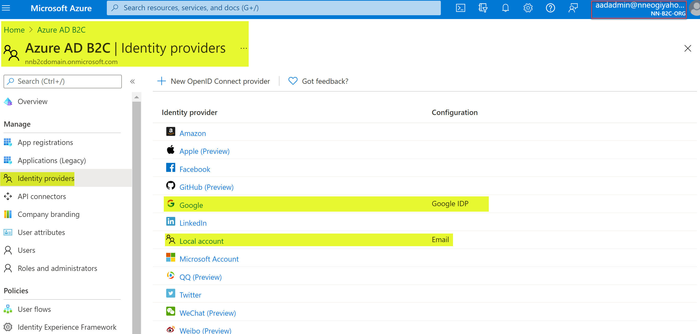
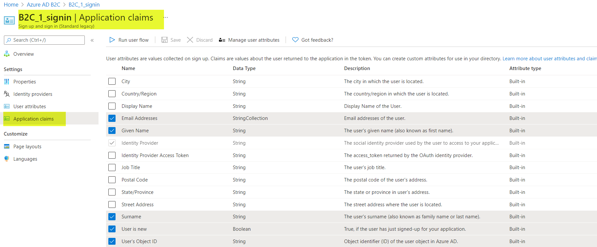
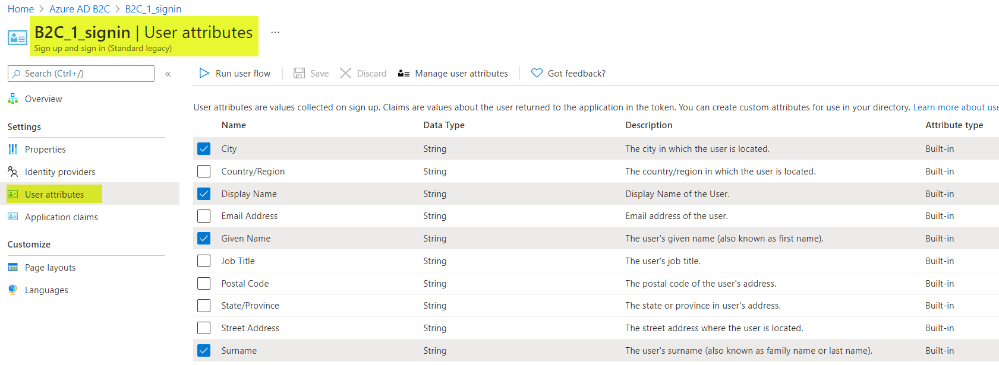

## An application that's registered in b2C  tenant

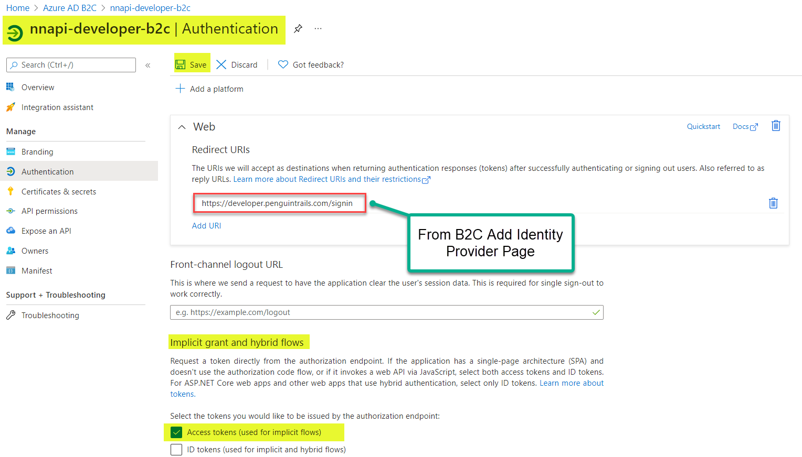

## APIM Configuration in Azure Portal

Add Identity Provider to APi Management Portal
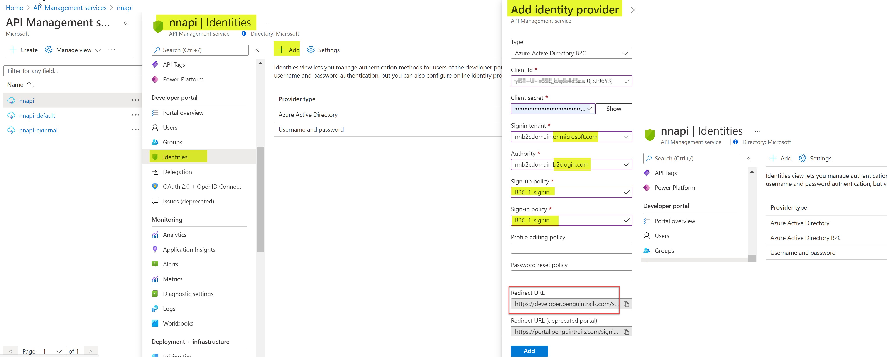

## Publish the API in Azure API Management

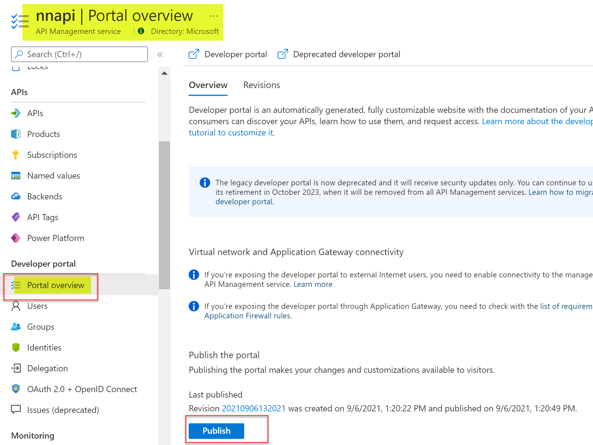

## Full Sign in experience

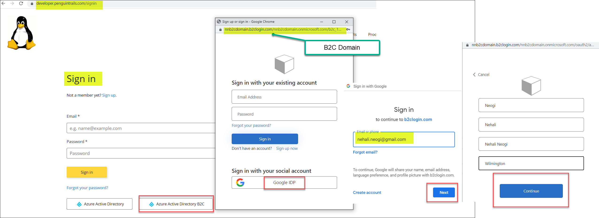

## User Created
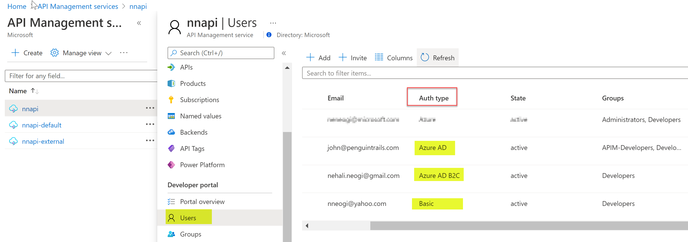

# TODO:

1. Add JWT token policy
2. [Protect backend API](https://docs.microsoft.com/en-us/azure/api-management/api-management-howto-protect-backend-with-aad)