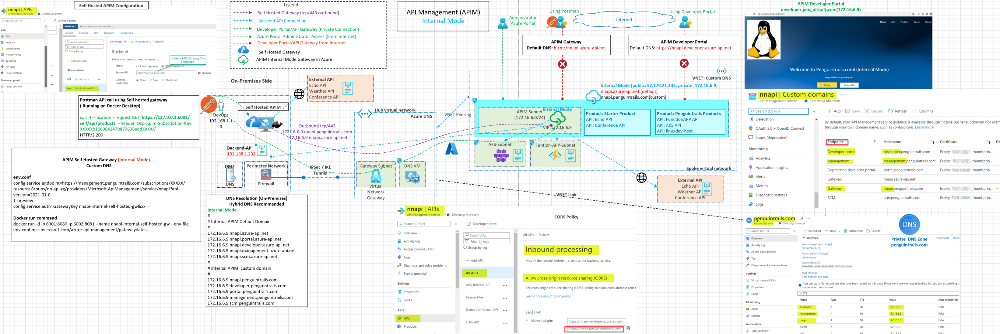
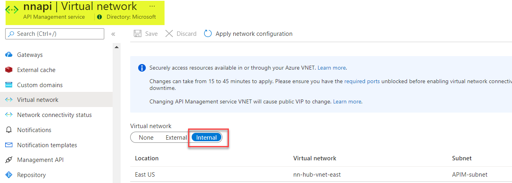
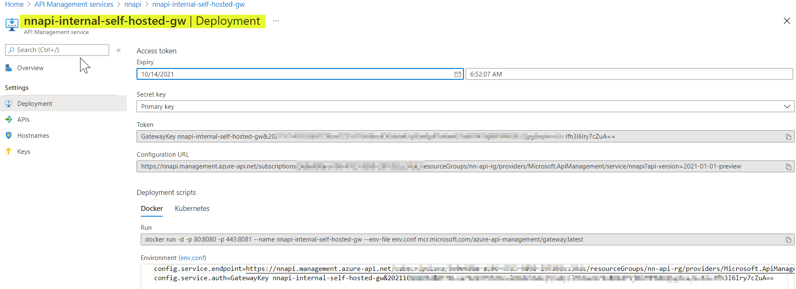
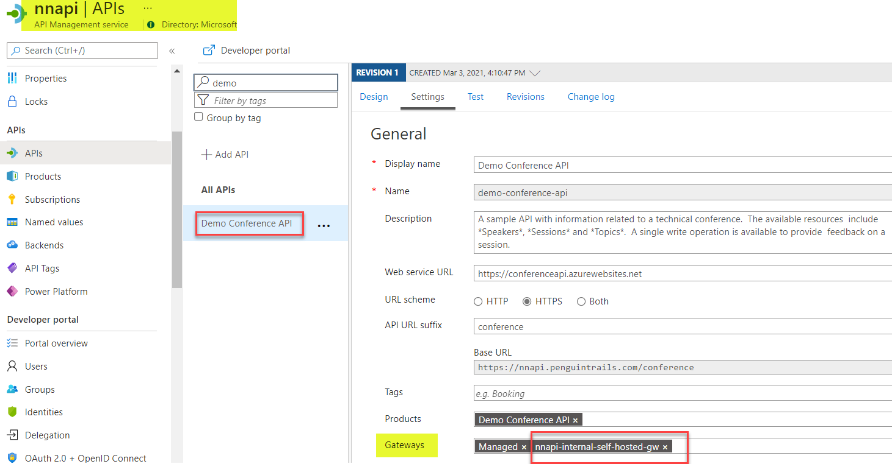

## Azure API Management (APIM) Architecture

This architecture demonstrates the connectivity architecture and traffic flows to and from API Management (APIM). APIM can be deployed in various modes. APIM can be deployed inside an Azure Virtual Network (VNET) to access backend services with the network. This diagram shows APIM in Internal Mode only. Note: For design option for external access with Application gateway and Custom DNS refer to the next article. Main consideration for APIM in Internal Mode is it's more secure and it's not reachable from the public internet for external consumers. However, DNS needs to be configured manually.

## Azure Documentation links


1. [APIM Internal Mode](https://docs.microsoft.com/en-us/azure/api-management/api-management-using-with-internal-vnet)
2. [Internal APIM Self Hosted Gateway](https://docs.microsoft.com/en-us/azure/api-management/self-hosted-gateway-overview)
3. [VIP and DIP Address](https://docs.microsoft.com/en-us/azure/api-management/api-management-using-with-internal-vnet?tabs=stv2#vip-and-dip-addresses)
4. [Public and Private IP address](https://docs.microsoft.com/en-us/azure/api-management/api-management-using-with-internal-vnet?tabs=stv2#routing)

## Reference Architecture


Download [Multi-tab Visio](APIM-all-reference-architectures-visio.vsdx) and [PDF](APIM-all-reference-architectures-PDF.pdf)


## Design components and guidelines

0. **Traffic Flows**
   
   1. Blue/Cyan : Backend API Connections
   2. Green: Developer Portal Access from on-premises
   3. Red: Developer Portal Access from Internet (Not allowed in Internal Mode)
   4. Purple: Self-hosted APIM Gateway on-premises outbound connection to APIM Management plane
   5. Note: VPN/Private Connectivity is required.


1. APIM in Internal mode is accessible from on-premise **via a private IP.** - 172.16.6.9 in this example. Note: APIM in Internal Mode can be deployed in conjunction with Application gateway for external access. Detailed implementation with application gateway in the next section.
2. **DNS Considerations:** In APIM Internal Mode, DNS needs to be maintained and configured by the user. Custom domain using Azure Private DNS Zone and hybrid DNS should be leveraged. For POC/labs a local hosts file can be used.
```
# api default domain
#
172.16.6.9 nnapi.azure-api.net
172.16.6.9 nnapi.portal.azure-api.net
172.16.6.9 nnapi.developer.azure-api.net
172.16.6.9 nnapi.management.azure-api.net
172.16.6.9 nnapi.scm.azure-api.net
#
# api custom domain
#
172.16.6.9 nnapi.penguintrails.com
172.16.6.9 developer.penguintrails.com
172.16.6.9 portal.penguintrails.com
172.16.6.9 management.penguintrails.com
172.16.6.9 scm.penguintrails.com

```
Azure Private DNS Zone


3. Backend APIs needs to be routable from APIM in Internal Mode.

4. Backend APIs: The diagram shows Backend APIs running in Azure (AKS Cluster, Function App), externally hosted APIs (example weather API or conference API) and Backend APIs hosted on-premises
5. APIM Custom domain and LetsEncrypt Certificate deployed
   

6.  Self-hosted Gateway Consideration: 
   * Use Docker host or on-premises Kubernetes cluster to run API Management self-hosted gateway 
   * Backend APIs need to be routable from self-hosted APIM Gateway. Management.penguintrails.com resolves to private IP and needs to be routable over VPN/Private connection.
  
# Pre-requisites
Using Azure documentation link [here](https://docs.microsoft.com/en-us/azure/api-management/import-and-publish) ensure that you've deployed APIM in the Internal Mode.

Refer to common documentation link [here](README-common.md) for more details on pre-requisites
1. APIM is deployed in Internal Mode.
2. Products, APIs and subscriptions created.
3. VPN or Private Connectivity is required in this design.
4. Internal and External APIs routable from APIM subnet.
5. Azure Provided default DNS resolution for API endpoints.
6. Developer Portal Published.
7. Troubleshooting Notes - [here](README-troubleshooting.md).


# Validations:
Note: Private Connectivity and DNS configuration is required

0. Base validations from Azure Portal
   
   
   

1. From on-premises, validate connection to a backend API running in Azure. Using host headers, validate that both default domain and custom domains work.

    curl --location --request GET 'http://172.16.6.9/internal/listUsers' --header 'Host: nnapi.azure-api.net'
    curl --location --request GET 'http://172.16.6.9/internal/ListUsers' --header 'Host: nnapi.penguintrails.com'

2. From on-premises validate connection to an External API  (Demo Conference API)

    curl --location --request GET 'https://nnapi.azure-api.net/conference/sessions' --header 'Ocp-Apim-Subscription-Key: XXXXX'
    curl --location --request GET 'https://nnapi.penguintrails.com/conference/sessions' --header 'Ocp-Apim-Subscription-Key: XXXXX'

3. Verify Developer Portal Access
    
    Access developer Portal via Private Window using "developer.penguintrails.com". Developer portal resolves to private IP and is reachable over VPN/ExR connection. Navigate to API and products.  API call will fail because of the subscription key requirement. You'll need to register to see subscriptions.


    
   
4. Packet Capture on backend API server to validate the source IP of the APIM.  More info on [VIP and DIP Address](https://docs.microsoft.com/en-us/azure/api-management/api-management-using-with-internal-vnet?tabs=stv2#vip-and-dip-addresses)

NOTE: 172.16.6.8 is the DIP IP address. The VIP IP address of the APIM is 172.16.6.9

```
Sample API listening on private and public IP address on Azure linux VM for demo (this can be AKS or Functon APP)
nehali@nn-linux-dev:~/api$ node app.js
Example app listening at http://:::3001


Note: APIM Source: 172.16.6.8  (for internal backend api)
root@nn-linux-dev:~# tcpdump -ni eth0 port 3001
tcpdump: verbose output suppressed, use -v or -vv for full protocol decode
listening on eth0, link-type EN10MB (Ethernet), capture size 262144 bytes
12:43:08.510672 IP 172.16.6.8.50910 > 172.16.1.5.3001: Flags [SEW], seq 3330657178, win 64240, options [mss 1418,nop,wscale 8,nop,nop,sackOK], length 0
12:43:08.510755 IP 172.16.1.5.3001 > 172.16.6.8.50910: Flags [S.], seq 2877633192, ack 3330657179, win 64240, options [mss 1460,nop,nop,sackOK,nop,wscale 7], length 0
12:43:08.512412 IP 172.16.6.8.50910 > 172.16.1.5.3001: Flags [.], ack 1, win 16395, length 0
12:43:08.512412 IP 172.16.6.8.50910 > 172.16.1.5.3001: Flags [P.], seq 1:360, ack 1, win 16395, length 359
12:43:08.512501 IP 172.16.1.5.3001 > 172.16.6.8.50910: Flags [.], ack 360, win 501, length 0
12:43:08.513593 IP 172.16.1.5.3001 > 172.16.6.8.50910: Flags [P.], seq 1:409, ack 360, win 501, length 408
12:43:08.529172 IP 172.16.6.8.50910 > 172.16.1.5.3001: Flags [.], ack 409, win 16394, length 0
12:43:13.515048 IP 172.16.1.5.3001 > 172.16.6.8.50910: Flags [F.], seq 409, ack 360, win 501, length 0
12:43:13.516627 IP 172.16.6.8.50910 > 172.16.1.5.3001: Flags [.], ack 410, win 16394, length 0


Note: APIM Source:52.179.21.145 (for external backend api)
root@nn-linux-dev:~# tcpdump -ni eth0 port 3001
tcpdump: verbose output suppressed, use -v or -vv for full protocol decode
listening on eth0, link-type EN10MB (Ethernet), capture size 262144 bytes
12:42:08.188182 IP 52.179.21.145.1024 > 172.16.1.5.3001: Flags [SEW], seq 1231137691, win 64240, options [mss 1440,nop,wscale 8,nop,nop,sackOK], length 0
12:42:08.188262 IP 172.16.1.5.3001 > 52.179.21.145.1024: Flags [S.], seq 3963240076, ack 1231137692, win 64240, options [mss 1460,nop,nop,sackOK,nop,wscale 7], length 0
12:42:08.190002 IP 52.179.21.145.1024 > 172.16.1.5.3001: Flags [.], ack 1, win 16425, length 0
12:42:08.190002 IP 52.179.21.145.1024 > 172.16.1.5.3001: Flags [P.], seq 1:386, ack 1, win 16425, length 385
12:42:08.190095 IP 172.16.1.5.3001 > 52.179.21.145.1024: Flags [.], ack 386, win 501, length 0
12:42:08.191130 IP 172.16.1.5.3001 > 52.179.21.145.1024: Flags [P.], seq 1:409, ack 386, win 501, length 408
12:42:08.215121 IP 52.179.21.145.1024 > 172.16.1.5.3001: Flags [.], ack 409, win 16423, length 0
12:42:13.192031 IP 172.16.1.5.3001 > 52.179.21.145.1024: Flags [F.], seq 409, ack 386, win 501, length 0
12:42:13.193543 IP 52.179.21.145.1024 > 172.16.1.5.3001: Flags [.], ack 410, win 16423, length 0

```


## API Self-hosted Gateway

1. Deploy Gateway in Portal 


2. Add APIs


3. Deploy Gateway on-premises using the env.conf and the docker run command

 
```

env.conf
config.service.endpoint=https://management.penguintrails.com/subscriptions/3e9e488a-a196-47d3-9850-297d
92cc34dc/resourceGroups/nn-api-rg/providers/Microsoft.ApiManagement/service/nnapi?api-version=2021-01-0
1-preview
config.service.auth=GatewayKey nnapi-internal-self-hosted-gw&xx==

docker run -d -p 6001:8080 -p 6002:8081 --name nnapi-internal-self-hosted-gw --env-file env.conf mcr.mi
crosoft.com/azure-api-management/gateway:latest


```

Adjust the listening port per your environment. Default is 80 and 443. In this example it's changed to 6001 and 6002.

```

docker ps
CONTAINER ID   IMAGE                                                   COMMAND                  CREATED      STATUS      PORTS
  NAMES
2ec68d21b845   mcr.microsoft.com/azure-api-management/gateway:latest   "/bin/sh -c 'dotnet …"   8 days ago   Up 8 days   0.0.0.0:6001->8080/tcp, :::6001->8080/tcp, 0.0.0.0:6002->8081/tcp, :::6002->8081/tcp   nnapi-internal-self-hosted-gw

Troubleshooting
docker logs 2e --follow

docker exec -it 2e sh
/app


/app $  hping -S -p 443 management.penguintrails.com
HPING management.penguintrails.com (eth0 172.16.6.9): S set, 40 headers + 0 data bytes

/app $ netstat -ant | grep 172.16.6.9
tcp     1302      0 172.17.0.2:36140        172.16.6.9:443          ESTABLISHED

```
3. Validate self-hosted gateway container is running and online. For any troubleshooting of the container, use the following command:
   
```
docker logs 2e --follow

```

4. Validate local api running on 192.168.1.232

   1. On 192.168.1.232
    node app.js
Server started on port 3001...
Mysql Connected...

   2. Test local api connection using curl or postman
        curl --location --request GET 'https://127.0.0.1:6002/self/api/products' --header 'Ocp-Apim-Subscription-Key: 0a1b8XXXXXXXXXedd70d135'

   3. Self hosted container logs:

Successful Connection:
   
```
   [Info] 2021-09-14T11:14:18.841, isRequestSuccess: True, totalTime: 16, category: GatewayLogs, callerIpAddress: 172.17.0.1, timeGenerated: 09/14/2021 11:14:18, region: nn-eastus, correlationId: 149e8d6d-4850-4712-b96d-db263780476c, method: GET, url: https://127.0.0.1:6002/self/api/products, backendResponseCode: 200, responseCode: 200, responseSize: 695, cache: none, backendTime: 8, apiId: self-hosted-api, operationId: 60be68c8e859fe8bcf3a3d28, apimSubscriptionId: all-api-subscription, clientProtocol: HTTP/2.0, backendProtocol: HTTP/1.1, apiRevision: 1, clientTlsVersion: 1.2, backendMethod: GET, **backendUrl: http://192.168.1.232:3001/api/products**

```   

Container logs for a failed Connection (In case the backend API is not running)


```
sVersion: 1.2, lastError: {
  "elapsed": 2400,
  "source": "request-forwarder",
  "path": "forward-request\\forward-request",
  "reason": "BackendConnectionFailure",
  "message": "LogError connecting to 192.168.1.232:3001",
  "section": "backend",
  "transportErrorCode": 111
}, errors: [
  {
    "elapsed": 2399,
    "source": "request-forwarder",
    "path": "forward-request\\forward-request",
    "message": "LogError connecting to 192.168.1.232:3001",
    "section": "backend"
  }
]

```
4. Validate External API.

curl --location --request GET 'https://localhost:6002/conference/sessions' --header 'Ocp-Apim-Subscription-Key: XXXXb108XXXXXXdd70dXXX'

