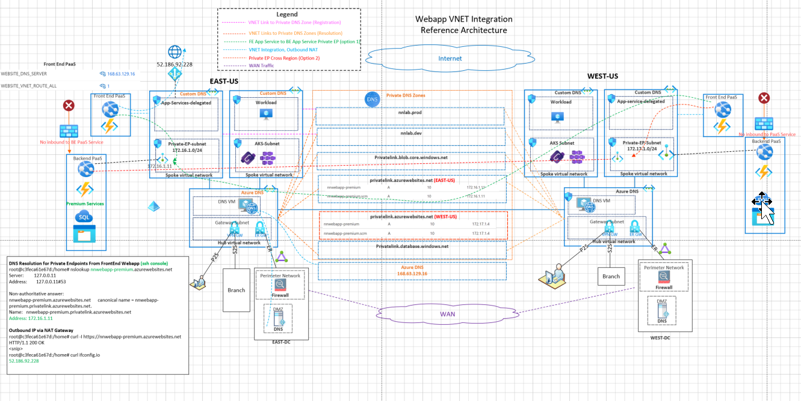
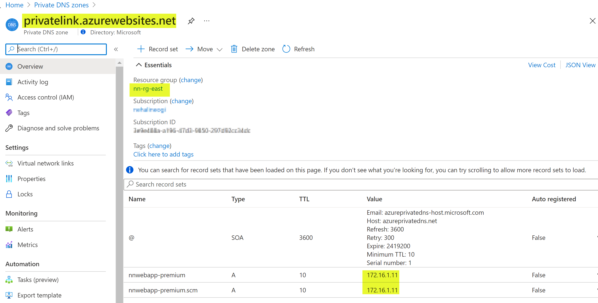

## Azure Web APP, Function App, Logic App Architecture

This architecture demonstrates the connectivity architecture and traffic flows Azure Web APP and Function app. This covers VNET integration, private endpoints and DNS architecture in a multi-region design

## Azure Documentation links

1. [VNET Integration with App services](https://docs.microsoft.com/en-us/azure/app-service/web-sites-integrate-with-vnet#how-regional-vnet-integration-works)
2. [VNET Integration and Subnet Delegation](https://docs.microsoft.com/en-us/azure/app-service/web-sites-integrate-with-vnet)
3. [Network Isolation with VNET Integration](https://docs.microsoft.com/en-us/azure/virtual-network/vnet-integration-for-azure-services)
4. [Control Outbound IP using Azure NAT Gateway](https://docs.microsoft.com/en-us/azure/azure-functions/functions-how-to-use-nat-gateway)
5. [Premium SKU requirement for Private Endpoints](https://docs.microsoft.com/en-us/azure/app-service/networking/private-endpoint)
6. [DNS Private Zone with App Services](https://docs.microsoft.com/en-us/azure/app-service/web-sites-integrate-with-vnet#azure-dns-private-zones)

## Reference Architecture



Download Visio link here

## Design Components

1. Hub Using Azure DNS, Spokes with Custom DNS server in Hub VNET
2. Centrazlied Private DNS Zones
3. Private Endpoints Per region
4. Private Endpoints Cross Region
5. VNET link to Private Zone Zone for Registration
6. VNET links to Priave DNS Zones for Resolution
7. Front End App Service talking to BE App Service via Private Endpoints
8. VNET Integration and Outbound NAT

## Design Considerations and Planning

1. Create Private Endpoints per region and establish routing for the other region to connect to the private endpoint.
2. Create Private endpoints cross regions if end-to-end IP routing is not in place.
3. Centralized Private DNS Zones vs Prviate DNS Zones Per region. In the above architecture both east and the west hubs are linked to the same Private DNS Zone in the east region.


## Design Validations

1. From FE Web APP ssh Console

```
DNS Resolution for Private Endpoints From FrontEnd Webapp (ssh console)
root@c3feca61e67d:/home# nslookup nnwebapp-premium.azurewebsites.net
Server:         127.0.0.11
Address:        127.0.0.11#53

Non-authoritative answer:
nnwebapp-premium.azurewebsites.net      canonical name = nnwebapp-premium.privatelink.azurewebsites.net.
Name:   nnwebapp-premium.privatelink.azurewebsites.net
Address: 172.16.1.11

Access Backend website via Private Endpoint

root@c3feca61e67d:/home# curl -I https://nnwebapp-premium.azurewebsites.net
HTTP/1.1 200 OK
<snip>

Outbound IP via NAT Gateway
root@c3feca61e67d:/home# curl ifconfig.io
52.186.92.228
```

2. DNS private zones

DNS private zone for privatelink.azurewebsites.net in each regions. Note that a vnet can only be linked to once to the same private DNS zone.




