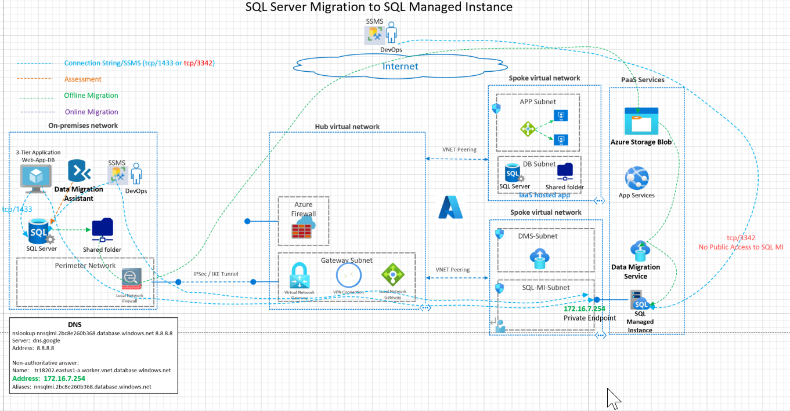
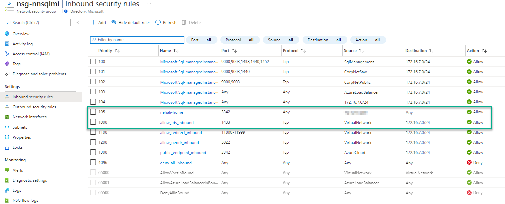
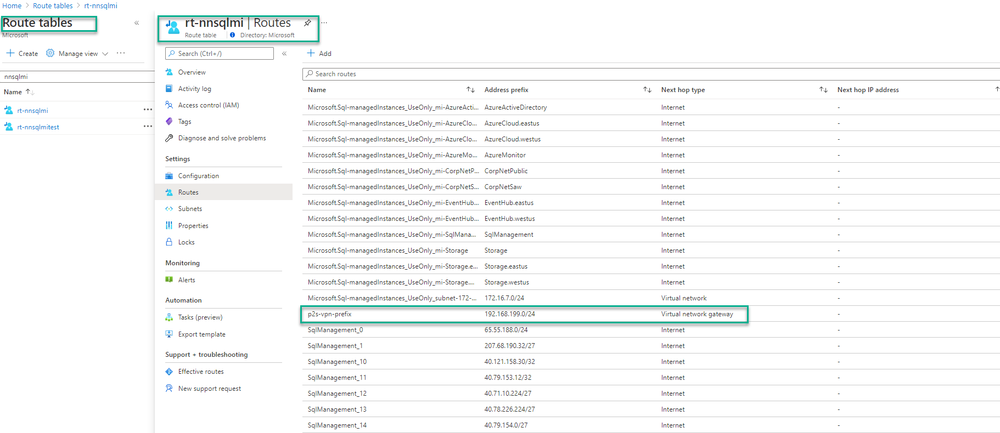
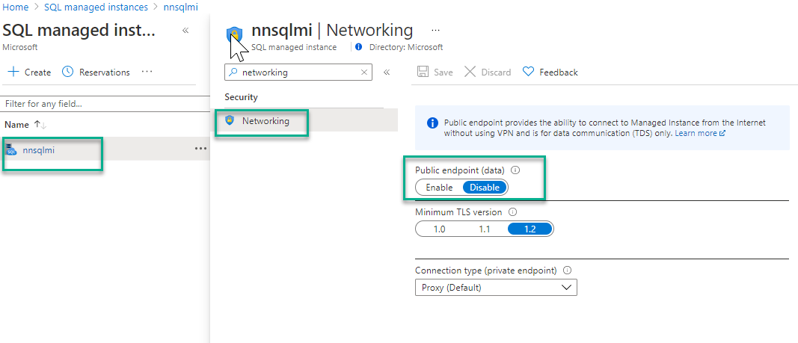
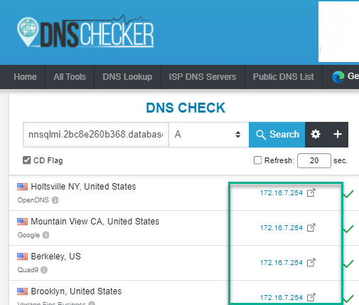
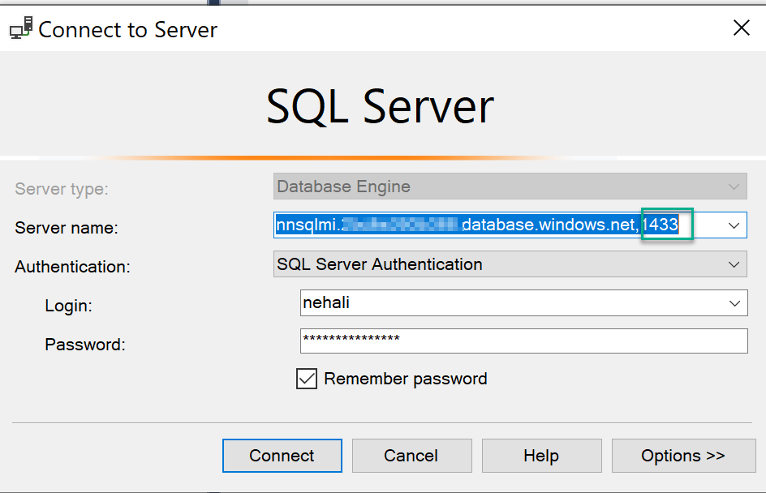

## Azure SQL MI Migration Architecture

This architecture demonstrates the connectivity architecture and traffic flows for migrating on-premises SQL database to SQL Managed Instance PaaS service in Azure.

## Azure Documentation links

1. [SQL MI Connectivity Architecture](https://docs.microsoft.com/en-us/azure/azure-sql/managed-instance/connectivity-architecture-overview)
2. [SQL MI Network Requirements](https://docs.microsoft.com/en-us/azure/azure-sql/managed-instance/connectivity-architecture-overview#network-requirements)
3. [Networking Constraints](https://docs.microsoft.com/en-us/azure/azure-sql/managed-instance/connectivity-architecture-overview#networking-constraints)

## Reference Architecture



Download Visio link here.

## Design Components

1. DMS (Data Migration Services) is PaaS service Azure used for live/online Migration of SQL Server to SQL Managed Instance. DMS-Subnet routable from on-premises
2. SQL-MI gets deployed in a dedicated subnet. This subnet routable from on-premises
3. SQL Server On-Premises, File share server on-premises are routable from Azure
4. SQL-MI PaaS service Deployed in Private mode and no public Access to SQLMI instance.
5. DMA (Data Migration Assistant) is deployed on-premises
6. Storage Account Access

## Design Considerations and Planning

1. Azure Subnet planning for DMS subnet and SQL MI subnet

   Create a seperate dedicated subnet for SQL MI and Azure Data Migration Service (DMS)

2. NSG
   Public Uses tcp/3342
   Private Uses tcp/1433
   
3. Route tables and NVAs
   Add On-Prem routes via VNG:
   
4. SQL MI Deployment (Public vs Private)
   
5. DNS resolution for SQL MI in private mode. Notice public google DNS resolves to private IP

```
    nslookup nnsqlmi.2bc8e260b368.database.windows.net 8.8.8.8
    Server:  dns.google
    Address:  8.8.8.8

    Non-authoritative answer:
    Name:    tr18202.eastus1-a.worker.vnet.database.windows.net
    Address:  172.16.7.254
    Aliases:  nnsqlmi.2bc8e260b368.database.windows.net

```

DNS Checker Output
{ width=50% }

6. SSMS Connection String
   Note the , seperated ports. Use tcp/1433 (private endpoint) or tcp/3342 (public endpoint)

   

## Tools and Traffic Flows

1. SSMS (local DB, SQLMI)
2. Connection String (local DB, SQL MI)
3. DMS
4. Storage account
